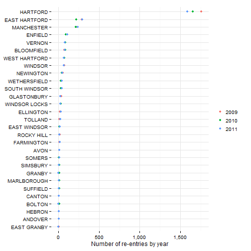
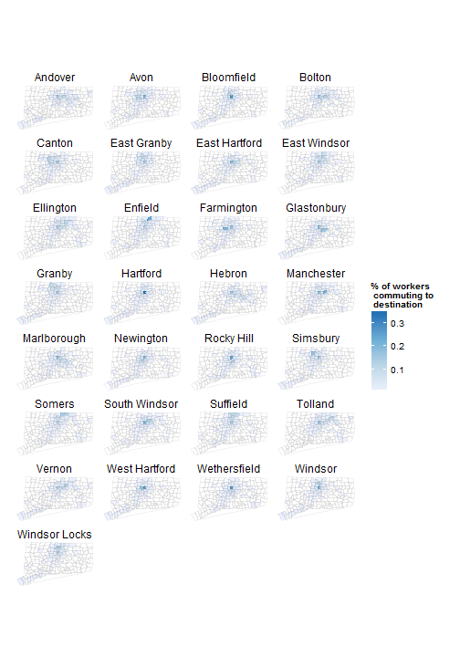

## Other indicators

This page reviews several additional indicators for consideration. Generally, these indicators are used rarely, if at all, in other reports but may be of particular relevance for the Hartford region. 

### 211 calls data

United way of CT publishes some [data on calls to the 211](http://www.ctunitedway.org/media.asp). Data on call volumes by category and by town is available which would show the volume and trends in requests for assistance across the region in more detail. 

### Adult literacy

There is little to no current data on adult literacy for the Hartford region. The most recent national adult literacy survey (using the PIAAC) instrument estimated that 1 out of 6 adults has low literacy skills. NCES has [published county-level estimates](http://nces.ed.gov/naal/estimates/StateEstimates.aspx) for the 2003 and 1992 national surveys, which show a substantial improvement in literacy rates for Hartford and Tolland counties during that time.

### Chronic absenteeism

SDE [released data on chronic absenteeism](http://www.sde.ct.gov/sde/cwp/view.asp?a=2678&pm=1&Q=334924) earlier in the year. Levels for some districts in the Hartford region are high, with Hartford and Manchester above 20 percent. More rural and suburban districts - Somers, Regional District 08 (Andover / Hebron / Marlborough) - also have high rates. 

 

Looking at subgroups for all districts in the region (with only one year of data), the highest rates of absenteeism are for ELL students and those on free lunch programs, followed by all non-White race / ethnicity subgroups. 

 

### Commuting patterns

Most towns in the region have a high percentage of commuters – over 75 percent of workers in every town except Hartford. At the same time, twenty percent of all workers in the region commute to Hartford. Enfield, Manchester and Simsbury also act as local hubs for employment. The maps below show where residents of selected towns in the region travel every day for work, i.e. for each town, the map shows where the residents of that town commute to for work.

 

### Public transportation usage

The Census collects data on commuting patterns and we can look at commuting patterns for the Metro Hartford region. 

For those that commute to work in Metro Hartford, driving alone is an increasingly frequent means of transport, instead of alternatives like carpooling, public transit, walking or biking. As of 2000, 83 percent of Hartford-area residents drove to work alone (compared to 67 percent in 1980), one of the highest rates in the country. Only Detroit, Grand Rapids, St. Louis, Kansas City and Indianapolis had higher rates when compared to other metro areas (as in the graphs below). (This data is old but could be updated easily.)

 

### Re-entry rates

Data on re-entry rates are not currently published by the CT Department of Correction. However, we are requesting if data on re-entry rates can be shared with this group as a potential indicator. More soon...

### School enrollment patterns

School choice is one of the characteristic attributes of education in the Hartford region. While not a standard indicator as such, school enrollment patterns reveal how parents make choices about their children's education. 

The percent of school-age residents attending their local public school district can be low - less than 2/3rds in Bloomfield - and consequently other school performance data for these same districts only represents a fraction of the population. (In other words, data on Bloomfield Public Schools only describes 2/3rds of the residents of Bloomfield.)  

 

The chart below looks at the same enrollment patterns by grade. Enrollment patterns in many districts shift between pre-K / K programs and first grade, and at the transitions to middle school and high school. For example, in Bloomfield, roughly half of 10th graders living in Bloomfield don't attend Bloomfield public schools, instead opting for magnet, charter and private school options. 

 

### School languages

Given the poor test results for ELL students in the region, data on school languages can provide additional insight as to who ELL students are and where they learn. 

Here are a few factoids on foreign languages in Hartford-area schools: 
* 97 languages are spoken in schools in the region
* 3 out of 4 ELL students are Spanish-speaking
* 60 percent of ELL students attend Hartford Public Schools
* West Hartford Public Schools is the most linguistically diverse district in the region, with 46 distinct languages reported in 2010-11. (Hartford has 43, while Manchester and East Hartford both have 33.)

The visual below shows the distribution of ELL students by district and the concentration of particular languages in the region (for any occurence of more than 5 students speaking a particular language in a district). Outside of Spanish, there are significant groups speaking Vietnamese, Chinese, Serbo-Croatian, Urdu, Portuguese, Arabic, and Karen (from Myanmar), among others. 

<svg xmlns="http://www.w3.org/2000/svg" height="901" width="501"><g transform="translate(30,30)"><g><path style="stroke-width: 174.119; fill: none; stroke: rgb(0, 0, 0); stroke-opacity: 0.2;" d="M15,152.58100521920608C235,152.58100521920608 235,98.6631972678488 455,98.6631972678488" class="link"><title>Hartford School District → Spanish
3,149</title></path><path style="stroke-width: 24.6056; fill: none; stroke: rgb(0, 0, 0); stroke-opacity: 0.2;" d="M15,290.1985039994956C235,290.1985039994956 235,198.02569523499795 455,198.02569523499795" class="link"><title>East Hartford School District → Spanish
445</title></path><path style="stroke-width: 12.6622; fill: none; stroke: rgb(0, 0, 0); stroke-opacity: 0.2;" d="M15,431.02140203169597C235,431.02140203169597 235,238.00292730525328 455,238.00292730525328" class="link"><title>West Hartford School District → Spanish
229</title></path><path style="stroke-width: 9.84225; fill: none; stroke: rgb(0, 0, 0); stroke-opacity: 0.2;" d="M15,359.14467410845646C235,359.14467410845646 235,220.1707594730854 455,220.1707594730854" class="link"><title>Manchester School District → Spanish
178</title></path><path style="stroke-width: 8.5705; fill: none; stroke: rgb(0, 0, 0); stroke-opacity: 0.2;" d="M15,243.9259393548379C235,243.9259393548379 235,268.68271263620136 455,268.68271263620136" class="link"><title>Hartford School District → Karen
155</title></path><path style="stroke-width: 4.36819; fill: none; stroke: rgb(0, 0, 0); stroke-opacity: 0.2;" d="M15,256.7540414852656C235,256.7540414852656 235,382.67197918360756 455,382.67197918360756" class="link"><title>Hartford School District → Serbo-Croatian
79</title></path><path style="stroke-width: 3.98114; fill: none; stroke: rgb(0, 0, 0); stroke-opacity: 0.2;" d="M15,382.24924395721234C235,382.24924395721234 235,227.08245243129 455,227.08245243129" class="link"><title>Wethersfield School District → Spanish
72</title></path><path style="stroke-width: 3.81525; fill: none; stroke: rgb(0, 0, 0); stroke-opacity: 0.2;" d="M15,320.15947326279047C235,320.15947326279047 235,212.23613595706655 455,212.23613595706655" class="link"><title>Capitol Region Education Council → Spanish
69</title></path><path style="stroke-width: 3.37291; fill: none; stroke: rgb(0, 0, 0); stroke-opacity: 0.2;" d="M15,443.90479770578935C235,443.90479770578935 235,542.5304927630515 455,542.5304927630515" class="link"><title>West Hartford School District → Vietnamese
61</title></path><path style="stroke-width: 2.76468; fill: none; stroke: rgb(0, 0, 0); stroke-opacity: 0.2;" d="M15,452.5582372894615C235,452.5582372894615 235,742.6378272889905 455,742.6378272889905" class="link"><title>West Hartford School District → Chinese
50</title></path><path style="stroke-width: 2.43292; fill: none; stroke: rgb(0, 0, 0); stroke-opacity: 0.2;" d="M15,251.9158564145224C235,251.9158564145224 235,346.672629695886 455,346.672629695886" class="link"><title>Hartford School District → Somali
44</title></path><path style="stroke-width: 2.21174; fill: none; stroke: rgb(0, 0, 0); stroke-opacity: 0.2;" d="M15,385.34568240248797C235,385.34568240248797 235,385.96194503171296 455,385.96194503171296" class="link"><title>Wethersfield School District → Serbo-Croatian
40</title></path><path style="stroke-width: 2.04586; fill: none; stroke: rgb(0, 0, 0); stroke-opacity: 0.2;" d="M15,544.3162467218895C235,544.3162467218895 235,251.49455195966868 455,251.49455195966868" class="link"><title>Newington School District → Spanish
37</title></path><path style="stroke-width: 1.93527; fill: none; stroke: rgb(0, 0, 0); stroke-opacity: 0.2;" d="M15,400.40504164789377C235,400.40504164789377 235,230.0406570174016 455,230.0406570174016" class="link"><title>Windsor School District → Spanish
35</title></path><path style="stroke-width: 1.93527; fill: none; stroke: rgb(0, 0, 0); stroke-opacity: 0.2;" d="M15,448.43886828637153C235,448.43886828637153 235,602.4914620263463 455,602.4914620263463" class="link"><title>West Hartford School District → Urdu
35</title></path><path style="stroke-width: 1.93527; fill: none; stroke: rgb(0, 0, 0); stroke-opacity: 0.2;" d="M15,306.23363166253023C235,306.23363166253023 235,539.2681736867789 455,539.2681736867789" class="link"><title>East Hartford School District → Vietnamese
35</title></path><path style="stroke-width: 1.82469; fill: none; stroke: rgb(0, 0, 0); stroke-opacity: 0.2;" d="M15,439.3707271252071C235,439.3707271252071 235,458.8176939339735 455,458.8176939339735" class="link"><title>West Hartford School District → Portuguese
33</title></path><path style="stroke-width: 1.82469; fill: none; stroke: rgb(0, 0, 0); stroke-opacity: 0.2;" d="M15,259.8504799305412C235,259.8504799305412 235,409.307204423484 455,409.307204423484" class="link"><title>Hartford School District → Albanian
33</title></path><path style="stroke-width: 1.7141; fill: none; stroke: rgb(0, 0, 0); stroke-opacity: 0.2;" d="M15,476.4564321178888C235,476.4564321178888 235,245.356968612783 455,245.356968612783" class="link"><title>Enfield School District → Spanish
31</title></path><path style="stroke-width: 1.60351; fill: none; stroke: rgb(0, 0, 0); stroke-opacity: 0.2;" d="M15,261.89634104616977C235,261.89634104616977 235,456.8271263620106 455,456.8271263620106" class="link"><title>Hartford School District → Portuguese
29</title></path><path style="stroke-width: 1.38234; fill: none; stroke: rgb(0, 0, 0); stroke-opacity: 0.2;" d="M15,365.53107840183753C235,365.53107840183753 235,483.3517645145558 455,483.3517645145558" class="link"><title>Manchester School District → Bengali
25</title></path><path style="stroke-width: 1.38234; fill: none; stroke: rgb(0, 0, 0); stroke-opacity: 0.2;" d="M15,441.47188178450136C235,441.47188178450136 235,516.669377134494 455,516.669377134494" class="link"><title>West Hartford School District → Nepali
25</title></path><path style="stroke-width: 1.32705; fill: none; stroke: rgb(0, 0, 0); stroke-opacity: 0.2;" d="M15,492.23460743094785C235,492.23460743094785 235,604.3437957391452 455,604.3437957391452" class="link"><title>Vernon School District → Urdu
24</title></path><path style="stroke-width: 1.32705; fill: none; stroke: rgb(0, 0, 0); stroke-opacity: 0.2;" d="M15,266.4580583985848C235,266.4580583985848 235,582.8427386566927 455,582.8427386566927" class="link"><title>Hartford School District → Arabic
24</title></path><path style="stroke-width: 1.21646; fill: none; stroke: rgb(0, 0, 0); stroke-opacity: 0.2;" d="M15,530.0309970878026C235,530.0309970878026 235,249.86339242153235 455,249.86339242153235" class="link"><title>Glastonbury School District → Spanish
22</title></path><path style="stroke-width: 1.21646; fill: none; stroke: rgb(0, 0, 0); stroke-opacity: 0.2;" d="M15,549.7073672292889C235,549.7073672292889 235,814.3047650024396 455,814.3047650024396" class="link"><title>Newington School District → Polish
22</title></path><path style="stroke-width: 1.21646; fill: none; stroke: rgb(0, 0, 0); stroke-opacity: 0.2;" d="M15,490.24403985898493C235,490.24403985898493 235,246.8222475199223 455,246.8222475199223" class="link"><title>Vernon School District → Spanish
22</title></path><path style="stroke-width: 1.21646; fill: none; stroke: rgb(0, 0, 0); stroke-opacity: 0.2;" d="M15,303.82836251307504C235,303.82836251307504 235,433.8136282322334 455,433.8136282322334" class="link"><title>East Hartford School District → Twi/Fante
22</title></path><path style="stroke-width: 1.05058; fill: none; stroke: rgb(0, 0, 0); stroke-opacity: 0.2;" d="M15,516.3539764340377C235,516.3539764340377 235,248.72987477638682 455,248.72987477638682" class="link"><title>South Windsor School District → Spanish
19</title></path><path style="stroke-width: 1; fill: none; stroke: rgb(0, 0, 0); stroke-opacity: 0.2;" d="M15,477.9770045686938C235,477.9770045686938 235,585.828590014637 455,585.828590014637" class="link"><title>Enfield School District → Arabic
18</title></path><path style="stroke-width: 1; fill: none; stroke: rgb(0, 0, 0); stroke-opacity: 0.2;" d="M15,446.9735893792322C235,446.9735893792322 235,584.5568385103275 455,584.5568385103275" class="link"><title>West Hartford School District → Arabic
18</title></path><path style="stroke-width: 1; fill: none; stroke: rgb(0, 0, 0); stroke-opacity: 0.2;" d="M15,248.70883088191547C235,248.70883088191547 235,283.46560416327895 455,283.46560416327895" class="link"><title>Hartford School District → Burmese
18</title></path><path style="stroke-width: 1; fill: none; stroke: rgb(0, 0, 0); stroke-opacity: 0.2;" d="M15,49.21131409503532C235,49.21131409503532 235,0.46999512115826714 455,0.46999512115826714" class="link"><title>Bloomfield School District → Patois
17</title></path><path style="stroke-width: 1; fill: none; stroke: rgb(0, 0, 0); stroke-opacity: 0.2;" d="M15,546.2515207501867C235,546.2515207501867 235,545.792811839324 455,545.792811839324" class="link"><title>Newington School District → Vietnamese
17</title></path><path style="stroke-width: 1; fill: none; stroke: rgb(0, 0, 0); stroke-opacity: 0.2;" d="M15,572.0020492914128C235,572.0020492914128 235,387.59310456984923 455,387.59310456984923" class="link"><title>Rocky Hill School District → Serbo-Croatian
17</title></path><path style="stroke-width: 1; fill: none; stroke: rgb(0, 0, 0); stroke-opacity: 0.2;" d="M15,265.213953666108C235,265.213953666108 235,556.8986827126367 455,556.8986827126367" class="link"><title>Hartford School District → Russian
17</title></path><path style="stroke-width: 1; fill: none; stroke: rgb(0, 0, 0); stroke-opacity: 0.2;" d="M15,333.0900310770692C235,333.0900310770692 235,214.61375833468895 455,214.61375833468895" class="link"><title>Achievement First Hartford Academy Inc. → Spanish
17</title></path><path style="stroke-width: 1; fill: none; stroke: rgb(0, 0, 0); stroke-opacity: 0.2;" d="M15,446.03359913691634C235,446.03359913691634 235,557.9216132704511 455,557.9216132704511" class="link"><title>West Hartford School District → Russian
16</title></path><path style="stroke-width: 1; fill: none; stroke: rgb(0, 0, 0); stroke-opacity: 0.2;" d="M15,368.73810393444444C235,368.73810393444444 235,600.0032525613926 455,600.0032525613926" class="link"><title>Manchester School District → Urdu
15</title></path><path style="stroke-width: 1; fill: none; stroke: rgb(0, 0, 0); stroke-opacity: 0.2;" d="M15,386.866254853293C235,386.866254853293 235,410.6895430151249 455,410.6895430151249" class="link"><title>Wethersfield School District → Albanian
15</title></path><path style="stroke-width: 1; fill: none; stroke: rgb(0, 0, 0); stroke-opacity: 0.2;" d="M15,450.650610032997C235,450.650610032997 235,708.2419905675722 455,708.2419905675722" class="link"><title>West Hartford School District → Punjabi
15</title></path><path style="stroke-width: 1; fill: none; stroke: rgb(0, 0, 0); stroke-opacity: 0.2;" d="M15,254.15524493298068C235,254.15524493298068 235,369.409660107335 455,369.409660107335" class="link"><title>Hartford School District → French
15</title></path><path style="stroke-width: 1; fill: none; stroke: rgb(0, 0, 0); stroke-opacity: 0.2;" d="M15,364.45285430035756C235,364.45285430035756 235,434.8089120182148 455,434.8089120182148" class="link"><title>Manchester School District → Twi/Fante
14</title></path><path style="stroke-width: 1; fill: none; stroke: rgb(0, 0, 0); stroke-opacity: 0.2;" d="M15,503.8934137409169C235,503.8934137409169 235,247.81753130590383 455,247.81753130590383" class="link"><title>Simsbury School District → Spanish
14</title></path><path style="stroke-width: 1; fill: none; stroke: rgb(0, 0, 0); stroke-opacity: 0.2;" d="M15,585.5684828578463C235,585.5684828578463 235,588.0403317612626 455,588.0403317612626" class="link"><title>Windsor Locks School District → Arabic
14</title></path><path style="stroke-width: 1; fill: none; stroke: rgb(0, 0, 0); stroke-opacity: 0.2;" d="M15,659.0489793320938C235,659.0489793320938 235,746.2595543990896 455,746.2595543990896" class="link"><title>Farmington School District → Chinese
13</title></path><path style="stroke-width: 1; fill: none; stroke: rgb(0, 0, 0); stroke-opacity: 0.2;" d="M15,263.0575054631482C235,263.0575054631482 235,470.80826150593646 455,470.80826150593646" class="link"><title>Hartford School District → Turkish
13</title></path><path style="stroke-width: 1; fill: none; stroke: rgb(0, 0, 0); stroke-opacity: 0.2;" d="M15,413.7503010396648C235,413.7503010396648 235,231.34005529354405 455,231.34005529354405" class="link"><title>East Windsor School District → Spanish
12</title></path><path style="stroke-width: 1; fill: none; stroke: rgb(0, 0, 0); stroke-opacity: 0.2;" d="M15,659.8507357152456C235,659.8507357152456 235,815.8529842250774 455,815.8529842250774" class="link"><title>Farmington School District → Polish
12</title></path><path style="stroke-width: 1; fill: none; stroke: rgb(0, 0, 0); stroke-opacity: 0.2;" d="M15,367.6045862892989C235,367.6045862892989 235,570.6862904537329 455,570.6862904537329" class="link"><title>Manchester School District → Telugu
12</title></path><path style="stroke-width: 1; fill: none; stroke: rgb(0, 0, 0); stroke-opacity: 0.2;" d="M15,548.2144415503168C235,548.2144415503168 235,759.3283460725324 455,759.3283460725324" class="link"><title>Newington School District → Gujarati
12</title></path><path style="stroke-width: 1; fill: none; stroke: rgb(0, 0, 0); stroke-opacity: 0.2;" d="M15,264.4121972829563C235,264.4121972829563 235,537.9687754106365 455,537.9687754106365" class="link"><title>Hartford School District → Vietnamese
12</title></path><path style="stroke-width: 1; fill: none; stroke: rgb(0, 0, 0); stroke-opacity: 0.2;" d="M15,304.7683527553909C235,304.7683527553909 235,445.52772808586815 455,445.52772808586815" class="link"><title>East Hartford School District → Lao
12</title></path><path style="stroke-width: 1; fill: none; stroke: rgb(0, 0, 0); stroke-opacity: 0.2;" d="M15,366.52636218781896C235,366.52636218781896 235,494.8446901935279 455,494.8446901935279" class="link"><title>Manchester School District → Bangla
11</title></path><path style="stroke-width: 1; fill: none; stroke: rgb(0, 0, 0); stroke-opacity: 0.2;" d="M15,369.95456189508843C235,369.95456189508843 235,757.6971865343961 455,757.6971865343961" class="link"><title>Manchester School District → Gujarati
11</title></path><path style="stroke-width: 1; fill: none; stroke: rgb(0, 0, 0); stroke-opacity: 0.2;" d="M15,253.4364288653274C235,253.4364288653274 235,358.3590827776879 455,358.3590827776879" class="link"><title>Hartford School District → Creole-Haitian
11</title></path><path style="stroke-width: 1; fill: none; stroke: rgb(0, 0, 0); stroke-opacity: 0.2;" d="M15,49.95777693452141C235,49.95777693452141 235,11.327045047975636 455,11.327045047975636" class="link"><title>Bloomfield School District → Spanish
10</title></path><path style="stroke-width: 1; fill: none; stroke: rgb(0, 0, 0); stroke-opacity: 0.2;" d="M15,532.6297936400874C235,532.6297936400874 235,847.2906163603839 455,847.2906163603839" class="link"><title>Glastonbury School District → Korean
10</title></path><path style="stroke-width: 1; fill: none; stroke: rgb(0, 0, 0); stroke-opacity: 0.2;" d="M15,574.407318440868C235,574.407318440868 235,869.5023581070093 455,869.5023581070093" class="link"><title>Rocky Hill School District → Tamil
10</title></path><path style="stroke-width: 1; fill: none; stroke: rgb(0, 0, 0); stroke-opacity: 0.2;" d="M15,504.9992846142297C235,504.9992846142297 235,586.7685802569529 455,586.7685802569529" class="link"><title>Simsbury School District → Arabic
10</title></path><path style="stroke-width: 1; fill: none; stroke: rgb(0, 0, 0); stroke-opacity: 0.2;" d="M15,518.8145391271586C235,518.8145391271586 235,758.609530004879 455,758.609530004879" class="link"><title>South Windsor School District → Gujarati
10</title></path><path style="stroke-width: 1; fill: none; stroke: rgb(0, 0, 0); stroke-opacity: 0.2;" d="M15,491.12873655763514C235,491.12873655763514 235,544.6592941941784 455,544.6592941941784" class="link"><title>Vernon School District → Vietnamese
10</title></path><path style="stroke-width: 1; fill: none; stroke: rgb(0, 0, 0); stroke-opacity: 0.2;" d="M15,597.5037568861436C235,597.5037568861436 235,253.78923402179262 455,253.78923402179262" class="link"><title>Avon School District → Spanish
10</title></path><path style="stroke-width: 1; fill: none; stroke: rgb(0, 0, 0); stroke-opacity: 0.2;" d="M15,478.9446415828425C235,478.9446415828425 235,719.0161001788912 455,719.0161001788912" class="link"><title>Enfield School District → Hmong
9</title></path><path style="stroke-width: 1; fill: none; stroke: rgb(0, 0, 0); stroke-opacity: 0.2;" d="M15,369.401626458432C235,369.401626458432 235,740.6196129451946 455,740.6196129451946" class="link"><title>Manchester School District → Chinese
9</title></path><path style="stroke-width: 1; fill: none; stroke: rgb(0, 0, 0); stroke-opacity: 0.2;" d="M15,388.24859344493393C235,388.24859344493393 235,600.6667750853803 455,600.6667750853803" class="link"><title>Wethersfield School District → Urdu
9</title></path><path style="stroke-width: 1; fill: none; stroke: rgb(0, 0, 0); stroke-opacity: 0.2;" d="M15,586.9231746776545C235,586.9231746776545 235,760.295983086681 455,760.295983086681" class="link"><title>Windsor Locks School District → Gujarati
9</title></path><path style="stroke-width: 1; fill: none; stroke: rgb(0, 0, 0); stroke-opacity: 0.2;" d="M15,584.9326071056915C235,584.9326071056915 235,253.26394535696903 455,253.26394535696903" class="link"><title>Windsor Locks School District → Spanish
9</title></path><path style="stroke-width: 1; fill: none; stroke: rgb(0, 0, 0); stroke-opacity: 0.2;" d="M15,658.1366358616109C235,658.1366358616109 235,588.6485607415846 455,588.6485607415846" class="link"><title>Farmington School District → Arabic
8</title></path><path style="stroke-width: 1; fill: none; stroke: rgb(0, 0, 0); stroke-opacity: 0.2;" d="M15,367.0516508526425C235,367.0516508526425 235,505.3699788583515 455,505.3699788583515" class="link"><title>Manchester School District → Pushto
8</title></path><path style="stroke-width: 1; fill: none; stroke: rgb(0, 0, 0); stroke-opacity: 0.2;" d="M15,548.7673769869732C235,548.7673769869732 235,781.7059684501547 455,781.7059684501547" class="link"><title>Newington School District → Malayalam
8</title></path><path style="stroke-width: 1; fill: none; stroke: rgb(0, 0, 0); stroke-opacity: 0.2;" d="M15,518.2616036905022C235,518.2616036905022 235,605.2837859814609 455,605.2837859814609" class="link"><title>South Windsor School District → Urdu
8</title></path><path style="stroke-width: 1; fill: none; stroke: rgb(0, 0, 0); stroke-opacity: 0.2;" d="M15,586.4531795564966C235,586.4531795564966 235,745.5130915596035 455,745.5130915596035" class="link"><title>Windsor Locks School District → Chinese
8</title></path><path style="stroke-width: 1; fill: none; stroke: rgb(0, 0, 0); stroke-opacity: 0.2;" d="M15,401.59385283670497C235,401.59385283670497 235,422.9842250772489 455,422.9842250772489" class="link"><title>Windsor School District → Patwa
8</title></path><path style="stroke-width: 1; fill: none; stroke: rgb(0, 0, 0); stroke-opacity: 0.2;" d="M15,454.4935113177588C235,454.4935113177588 235,781.208326557164 455,781.208326557164" class="link"><title>West Hartford School District → Malayalam
8</title></path><path style="stroke-width: 1; fill: none; stroke: rgb(0, 0, 0); stroke-opacity: 0.2;" d="M15,249.42764694956873C235,249.42764694956873 235,294.1844202309323 455,294.1844202309323" class="link"><title>Hartford School District → Afrikaans
8</title></path><path style="stroke-width: 1; fill: none; stroke: rgb(0, 0, 0); stroke-opacity: 0.2;" d="M15,307.42244285134143C235,307.42244285134143 235,570.1333550170765 455,570.1333550170765" class="link"><title>East Hartford School District → Telugu
8</title></path><path style="stroke-width: 1; fill: none; stroke: rgb(0, 0, 0); stroke-opacity: 0.2;" d="M15,333.7812003728897C235,333.7812003728897 235,422.5418767279238 455,422.5418767279238" class="link"><title>Achievement First Hartford Academy Inc. → Patwa
8</title></path><path style="stroke-width: 1; fill: none; stroke: rgb(0, 0, 0); stroke-opacity: 0.2;" d="M15,660.3760243800692C235,660.3760243800692 235,848.1476662872013 455,848.1476662872013" class="link"><title>Farmington School District → Korean
7</title></path><path style="stroke-width: 1; fill: none; stroke: rgb(0, 0, 0); stroke-opacity: 0.2;" d="M15,368.1298749541224C235,368.1298749541224 235,583.6997885835101 455,583.6997885835101" class="link"><title>Manchester School District → Arabic
7</title></path><path style="stroke-width: 1; fill: none; stroke: rgb(0, 0, 0); stroke-opacity: 0.2;" d="M15,546.9150432741744C235,546.9150432741744 235,558.9445438282653 455,558.9445438282653" class="link"><title>Newington School District → Russian
7</title></path><path style="stroke-width: 1; fill: none; stroke: rgb(0, 0, 0); stroke-opacity: 0.2;" d="M15,573.4949749703851C235,573.4949749703851 235,759.853634737356 455,759.853634737356" class="link"><title>Rocky Hill School District → Gujarati
7</title></path><path style="stroke-width: 1; fill: none; stroke: rgb(0, 0, 0); stroke-opacity: 0.2;" d="M15,571.3385267674253C235,571.3385267674253 235,252.82159700764396 455,252.82159700764396" class="link"><title>Rocky Hill School District → Spanish
7</title></path><path style="stroke-width: 1; fill: none; stroke: rgb(0, 0, 0); stroke-opacity: 0.2;" d="M15,389.24387723091536C235,389.24387723091536 235,812.7841925516345 455,812.7841925516345" class="link"><title>Wethersfield School District → Polish
7</title></path><path style="stroke-width: 1; fill: none; stroke: rgb(0, 0, 0); stroke-opacity: 0.2;" d="M15,263.88690861813274C235,263.88690861813274 235,515.7846804358438 455,515.7846804358438" class="link"><title>Hartford School District → Nepali
7</title></path><path style="stroke-width: 1; fill: none; stroke: rgb(0, 0, 0); stroke-opacity: 0.2;" d="M15,597.9737520073016C235,597.9737520073016 235,559.3315986339248 455,559.3315986339248" class="link"><title>Avon School District → Russian
7</title></path><path style="stroke-width: 1; fill: none; stroke: rgb(0, 0, 0); stroke-opacity: 0.2;" d="M15,414.4691171073181C235,414.4691171073181 235,601.3579443812007 455,601.3579443812007" class="link"><title>East Windsor School District → Urdu
6</title></path><path style="stroke-width: 1; fill: none; stroke: rgb(0, 0, 0); stroke-opacity: 0.2;" d="M15,479.46993024766607C235,479.46993024766607 235,813.1988941291268 455,813.1988941291268" class="link"><title>Enfield School District → Polish
6</title></path><path style="stroke-width: 1; fill: none; stroke: rgb(0, 0, 0); stroke-opacity: 0.2;" d="M15,657.1413520756294C235,657.1413520756294 235,254.23158237111772 455,254.23158237111772" class="link"><title>Farmington School District → Spanish
6</title></path><path style="stroke-width: 1; fill: none; stroke: rgb(0, 0, 0); stroke-opacity: 0.2;" d="M15,533.0721419894126C235,533.0721419894126 235,858.6176614083591 455,858.6176614083591" class="link"><title>Glastonbury School District → Japanese
6</title></path><path style="stroke-width: 1; fill: none; stroke: rgb(0, 0, 0); stroke-opacity: 0.2;" d="M15,547.716799657326C235,547.716799657326 235,745.1260367539439 455,745.1260367539439" class="link"><title>Newington School District → Chinese
6</title></path><path style="stroke-width: 1; fill: none; stroke: rgb(0, 0, 0); stroke-opacity: 0.2;" d="M15,573.0802733928928C235,573.0802733928928 235,571.7921613270455 455,571.7921613270455" class="link"><title>Rocky Hill School District → Telugu
6</title></path><path style="stroke-width: 1; fill: none; stroke: rgb(0, 0, 0); stroke-opacity: 0.2;" d="M15,517.8745488848427C235,517.8745488848427 235,587.210928606278 455,587.210928606278" class="link"><title>South Windsor School District → Arabic
6</title></path><path style="stroke-width: 1; fill: none; stroke: rgb(0, 0, 0); stroke-opacity: 0.2;" d="M15,517.211026360855C235,517.211026360855 235,459.89591803545346 455,459.89591803545346" class="link"><title>South Windsor School District → Portuguese
6</title></path><path style="stroke-width: 1; fill: none; stroke: rgb(0, 0, 0); stroke-opacity: 0.2;" d="M15,388.8844691970888C235,388.8844691970888 235,741.0343145226868 455,741.0343145226868" class="link"><title>Wethersfield School District → Chinese
6</title></path><path style="stroke-width: 1; fill: none; stroke: rgb(0, 0, 0); stroke-opacity: 0.2;" d="M15,402.42325599168953C235,402.42325599168953 235,540.6781590502526 455,540.6781590502526" class="link"><title>Windsor School District → Vietnamese
6</title></path><path style="stroke-width: 1; fill: none; stroke: rgb(0, 0, 0); stroke-opacity: 0.2;" d="M15,440.4489512266871C235,440.4489512266871 235,471.83119206375073 455,471.83119206375073" class="link"><title>West Hartford School District → Turkish
6</title></path><path style="stroke-width: 1; fill: none; stroke: rgb(0, 0, 0); stroke-opacity: 0.2;" d="M15,249.98058238622514C235,249.98058238622514 235,314.73735566758864 455,314.73735566758864" class="link"><title>Hartford School District → Kirundi
6</title></path><path style="stroke-width: 1; fill: none; stroke: rgb(0, 0, 0); stroke-opacity: 0.2;" d="M15,260.9287040320212C235,260.9287040320212 235,422.1548219222643 455,422.1548219222643" class="link"><title>Hartford School District → Patwa
6</title></path><path style="stroke-width: 1; fill: none; stroke: rgb(0, 0, 0); stroke-opacity: 0.2;" d="M15,267.28746155356936C235,267.28746155356936 235,599.2014961782409 455,599.2014961782409" class="link"><title>Hartford School District → Urdu
6</title></path><path style="stroke-width: 1; fill: none; stroke: rgb(0, 0, 0); stroke-opacity: 0.2;" d="M15,302.6671980960967C235,302.6671980960967 235,369.9902423158242 455,369.9902423158242" class="link"><title>East Hartford School District → French
6</title></path><path style="stroke-width: 1; fill: none; stroke: rgb(0, 0, 0); stroke-opacity: 0.2;" d="M15,302.9989593580905C235,302.9989593580905 235,398.2289803220041 455,398.2289803220041" class="link"><title>East Hartford School District → Taiwanese
6</title></path><path style="stroke-width: 1; fill: none; stroke: rgb(0, 0, 0); stroke-opacity: 0.2;" d="M15,465.4611483319074C235,465.4611483319074 235,585.1927142624822 455,585.1927142624822" class="link"><title>Canton School District → Arabic
5</title></path><path style="stroke-width: 1; fill: none; stroke: rgb(0, 0, 0); stroke-opacity: 0.2;" d="M15,699.2345096763705C235,699.2345096763705 235,746.7571962920803 455,746.7571962920803" class="link"><title>Ellington School District → Chinese
5</title></path><path style="stroke-width: 1; fill: none; stroke: rgb(0, 0, 0); stroke-opacity: 0.2;" d="M15,532.0492114315983C235,532.0492114315983 235,744.821922263783 455,744.821922263783" class="link"><title>Glastonbury School District → Chinese
5</title></path><path style="stroke-width: 1; fill: none; stroke: rgb(0, 0, 0); stroke-opacity: 0.2;" d="M15,545.6432917698646C235,545.6432917698646 235,460.3106196129457 455,460.3106196129457" class="link"><title>Newington School District → Portuguese
5</title></path><path style="stroke-width: 1; fill: none; stroke: rgb(0, 0, 0); stroke-opacity: 0.2;" d="M15,573.8820297760445C235,573.8820297760445 235,815.1618149292569 455,815.1618149292569" class="link"><title>Rocky Hill School District → Polish
5</title></path><path style="stroke-width: 1; fill: none; stroke: rgb(0, 0, 0); stroke-opacity: 0.2;" d="M15,504.4187024057405C235,504.4187024057405 235,558.5021954789402 455,558.5021954789402" class="link"><title>Simsbury School District → Russian
5</title></path><path style="stroke-width: 1; fill: none; stroke: rgb(0, 0, 0); stroke-opacity: 0.2;" d="M15,560.8961784181001C235,560.8961784181001 235,605.9196617336157 455,605.9196617336157" class="link"><title>Stafford School District → Urdu
5</title></path><path style="stroke-width: 1; fill: none; stroke: rgb(0, 0, 0); stroke-opacity: 0.2;" d="M15,493.14695090143084C235,493.14695090143084 235,744.2689868271266 455,744.2689868271266" class="link"><title>Vernon School District → Chinese
5</title></path><path style="stroke-width: 1; fill: none; stroke: rgb(0, 0, 0); stroke-opacity: 0.2;" d="M15,586.09377152267C235,586.09377152267 235,606.1961294519439 455,606.1961294519439" class="link"><title>Windsor Locks School District → Urdu
5</title></path><path style="stroke-width: 1; fill: none; stroke: rgb(0, 0, 0); stroke-opacity: 0.2;" d="M15,401.9532608705316C235,401.9532608705316 235,471.52707757358974 455,471.52707757358974" class="link"><title>Windsor School District → Turkish
5</title></path><path style="stroke-width: 1; fill: none; stroke: rgb(0, 0, 0); stroke-opacity: 0.2;" d="M15,402.8932511128474C235,402.8932511128474 235,601.0538298910398 455,601.0538298910398" class="link"><title>Windsor School District → Urdu
5</title></path><path style="stroke-width: 1; fill: none; stroke: rgb(0, 0, 0); stroke-opacity: 0.2;" d="M15,437.6566272715724C235,437.6566272715724 235,358.8567246706786 455,358.8567246706786" class="link"><title>West Hartford School District → Creole-Haitian
5</title></path><path style="stroke-width: 1; fill: none; stroke: rgb(0, 0, 0); stroke-opacity: 0.2;" d="M15,437.93309498990055C235,437.93309498990055 235,370.29435680598516 455,370.29435680598516" class="link"><title>West Hartford School District → French
5</title></path><path style="stroke-width: 1; fill: none; stroke: rgb(0, 0, 0); stroke-opacity: 0.2;" d="M15,454.8529193515854C235,454.8529193515854 235,792.120670027647 455,792.120670027647" class="link"><title>West Hartford School District → Mandarin
5</title></path><path style="stroke-width: 1; fill: none; stroke: rgb(0, 0, 0); stroke-opacity: 0.2;" d="M15,263.5551473561389C235,263.5551473561389 235,482.52236135957116 455,482.52236135957116" class="link"><title>Hartford School District → Bengali
5</title></path><path style="stroke-width: 1; fill: none; stroke: rgb(0, 0, 0); stroke-opacity: 0.2;" d="M15,267.7574566747273C235,267.7574566747273 235,740.0113839648726 455,740.0113839648726" class="link"><title>Hartford School District → Chinese
5</title></path><path style="stroke-width: 1; fill: none; stroke: rgb(0, 0, 0); stroke-opacity: 0.2;" d="M15,250.28469687638614C235,250.28469687638614 235,325.04147015774964 455,325.04147015774964" class="link"><title>Hartford School District → Krahan
5</title></path><path style="stroke-width: 1; fill: none; stroke: rgb(0, 0, 0); stroke-opacity: 0.2;" d="M15,250.5611645947143C235,250.5611645947143 235,335.31793787607785 455,335.31793787607785" class="link"><title>Hartford School District → Thai
5</title></path><path style="stroke-width: 1; fill: none; stroke: rgb(0, 0, 0); stroke-opacity: 0.2;" d="M15,308.0030250598306C235,308.0030250598306 235,757.254838185071 455,757.254838185071" class="link"><title>East Hartford School District → Gujarati
5</title></path><path style="stroke-width: 1; fill: none; stroke: rgb(0, 0, 0); stroke-opacity: 0.2;" d="M15,414.1926493889899C235,414.1926493889899 235,571.1286388030579 455,571.1286388030579" class="link"><title>East Windsor School District → Telugu
4</title></path><path style="stroke-width: 1; fill: none; stroke: rgb(0, 0, 0); stroke-opacity: 0.2;" d="M15,478.58523354901587C235,478.58523354901587 235,603.5696861278262 455,603.5696861278262" class="link"><title>Enfield School District → Urdu
4</title></path><path style="stroke-width: 1; fill: none; stroke: rgb(0, 0, 0); stroke-opacity: 0.2;" d="M15,657.7495810559515C235,657.7495810559515 235,559.6357131240858 455,559.6357131240858" class="link"><title>Farmington School District → Russian
4</title></path><path style="stroke-width: 1; fill: none; stroke: rgb(0, 0, 0); stroke-opacity: 0.2;" d="M15,530.8051066991216C235,530.8051066991216 235,411.5465929419423 455,411.5465929419423" class="link"><title>Glastonbury School District → Albanian
4</title></path><path style="stroke-width: 1; fill: none; stroke: rgb(0, 0, 0); stroke-opacity: 0.2;" d="M15,531.634509854106C235,531.634509854106 235,587.4873963246062 455,587.4873963246062" class="link"><title>Glastonbury School District → Arabic
4</title></path><path style="stroke-width: 1; fill: none; stroke: rgb(0, 0, 0); stroke-opacity: 0.2;" d="M15,531.1368679611153C235,531.1368679611153 235,545.2122296308348 455,545.2122296308348" class="link"><title>Glastonbury School District → Vietnamese
4</title></path><path style="stroke-width: 1; fill: none; stroke: rgb(0, 0, 0); stroke-opacity: 0.2;" d="M15,547.4403319389979C235,547.4403319389979 235,729.7072694747117 455,729.7072694747117" class="link"><title>Newington School District → Ukrainian
4</title></path><path style="stroke-width: 1; fill: none; stroke: rgb(0, 0, 0); stroke-opacity: 0.2;" d="M15,572.7485121308989C235,572.7485121308989 235,472.10765978207894 455,472.10765978207894" class="link"><title>Rocky Hill School District → Turkish
4</title></path><path style="stroke-width: 1; fill: none; stroke: rgb(0, 0, 0); stroke-opacity: 0.2;" d="M15,505.44163296355475C235,505.44163296355475 235,744.517807773622 455,744.517807773622" class="link"><title>Simsbury School District → Chinese
4</title></path><path style="stroke-width: 1; fill: none; stroke: rgb(0, 0, 0); stroke-opacity: 0.2;" d="M15,709.6492112538629C235,709.6492112538629 235,747.0060172385756 455,747.0060172385756" class="link"><title>Suffield School District → Chinese
4</title></path><path style="stroke-width: 1; fill: none; stroke: rgb(0, 0, 0); stroke-opacity: 0.2;" d="M15,387.72330478011037C235,387.72330478011037 235,527.4711335176457 455,527.4711335176457" class="link"><title>Wethersfield School District → Italian
4</title></path><path style="stroke-width: 1; fill: none; stroke: rgb(0, 0, 0); stroke-opacity: 0.2;" d="M15,387.50213060544786C235,387.50213060544786 235,471.2782566270944 455,471.2782566270944" class="link"><title>Wethersfield School District → Turkish
4</title></path><path style="stroke-width: 1; fill: none; stroke: rgb(0, 0, 0); stroke-opacity: 0.2;" d="M15,388.60800147876057C235,388.60800147876057 235,729.3755082127178 455,729.3755082127178" class="link"><title>Wethersfield School District → Ukrainian
4</title></path><path style="stroke-width: 1; fill: none; stroke: rgb(0, 0, 0); stroke-opacity: 0.2;" d="M15,403.30795269033973C235,403.30795269033973 235,758.1118881118883 455,758.1118881118883" class="link"><title>Windsor School District → Gujarati
4</title></path><path style="stroke-width: 1; fill: none; stroke: rgb(0, 0, 0); stroke-opacity: 0.2;" d="M15,438.18191593639597C235,438.18191593639597 235,411.2148316799485 455,411.2148316799485" class="link"><title>West Hartford School District → Albanian
4</title></path><path style="stroke-width: 1; fill: none; stroke: rgb(0, 0, 0); stroke-opacity: 0.2;" d="M15,449.6829730188484C235,449.6829730188484 235,647.2743535534238 455,647.2743535534238" class="link"><title>West Hartford School District → Dari
4</title></path><path style="stroke-width: 1; fill: none; stroke: rgb(0, 0, 0); stroke-opacity: 0.2;" d="M15,454.16175005576497C235,454.16175005576497 235,770.7659782078389 455,770.7659782078389" class="link"><title>West Hartford School District → German
4</title></path><path style="stroke-width: 1; fill: none; stroke: rgb(0, 0, 0); stroke-opacity: 0.2;" d="M15,599.1072696524471C235,599.1072696524471 235,858.8941291266874 455,858.8941291266874" class="link"><title>Avon School District → Japanese
4</title></path><path style="stroke-width: 1; fill: none; stroke: rgb(0, 0, 0); stroke-opacity: 0.2;" d="M15,598.8860954777846C235,598.8860954777846 235,847.8435517970403 455,847.8435517970403" class="link"><title>Avon School District → Korean
4</title></path><path style="stroke-width: 1; fill: none; stroke: rgb(0, 0, 0); stroke-opacity: 0.2;" d="M15,465.23997415724483C235,465.23997415724483 235,244.41697837046715 455,244.41697837046715" class="link"><title>Canton School District → Spanish
3</title></path><path style="stroke-width: 1; fill: none; stroke: rgb(0, 0, 0); stroke-opacity: 0.2;" d="M15,344.08531486305066C235,344.08531486305066 235,215.16669377134528 455,215.16669377134528" class="link"><title>East Granby School District → Spanish
3</title></path><path style="stroke-width: 1; fill: none; stroke: rgb(0, 0, 0); stroke-opacity: 0.2;" d="M15,699.0133355017081C235,699.0133355017081 235,588.9526752317456 455,588.9526752317456" class="link"><title>Ellington School District → Arabic
3</title></path><path style="stroke-width: 1; fill: none; stroke: rgb(0, 0, 0); stroke-opacity: 0.2;" d="M15,477.39642236020467C235,477.39642236020467 235,544.2998861603519 455,544.2998861603519" class="link"><title>Enfield School District → Vietnamese
3</title></path><path style="stroke-width: 1; fill: none; stroke: rgb(0, 0, 0); stroke-opacity: 0.2;" d="M15,658.5513374391031C235,658.5513374391031 235,616.970239063263 455,616.970239063263" class="link"><title>Farmington School District → Hindi
3</title></path><path style="stroke-width: 1; fill: none; stroke: rgb(0, 0, 0); stroke-opacity: 0.2;" d="M15,657.3901730221248C235,657.3901730221248 235,472.3011871849086 455,472.3011871849086" class="link"><title>Farmington School District → Turkish
3</title></path><path style="stroke-width: 1; fill: none; stroke: rgb(0, 0, 0); stroke-opacity: 0.2;" d="M15,531.4409824512763C235,531.4409824512763 235,571.5433403805503 455,571.5433403805503" class="link"><title>Glastonbury School District → Telugu
3</title></path><path style="stroke-width: 1; fill: none; stroke: rgb(0, 0, 0); stroke-opacity: 0.2;" d="M15,545.4221175952022C235,545.4221175952022 235,411.740120344772 455,411.740120344772" class="link"><title>Newington School District → Albanian
3</title></path><path style="stroke-width: 1; fill: none; stroke: rgb(0, 0, 0); stroke-opacity: 0.2;" d="M15,550.5644171561064C235,550.5644171561064 235,847.6500243942105 455,847.6500243942105" class="link"><title>Newington School District → Korean
3</title></path><path style="stroke-width: 1; fill: none; stroke: rgb(0, 0, 0); stroke-opacity: 0.2;" d="M15,550.3985365251094C235,550.3985365251094 235,826.3229793462353 455,826.3229793462353" class="link"><title>Newington School District → Tagalog
3</title></path><path style="stroke-width: 1; fill: none; stroke: rgb(0, 0, 0); stroke-opacity: 0.2;" d="M15,547.2468045361682C235,547.2468045361682 235,605.6984875589533 455,605.6984875589533" class="link"><title>Newington School District → Urdu
3</title></path><path style="stroke-width: 1; fill: none; stroke: rgb(0, 0, 0); stroke-opacity: 0.2;" d="M15,572.5549847280693C235,572.5549847280693 235,411.9060009757689 455,411.9060009757689" class="link"><title>Rocky Hill School District → Albanian
3</title></path><path style="stroke-width: 1; fill: none; stroke: rgb(0, 0, 0); stroke-opacity: 0.2;" d="M15,504.639876580403C235,504.639876580403 235,571.3221662058877 455,571.3221662058877" class="link"><title>Simsbury School District → Telugu
3</title></path><path style="stroke-width: 1; fill: none; stroke: rgb(0, 0, 0); stroke-opacity: 0.2;" d="M15,517.5704343946818C235,517.5704343946818 235,545.0187022280052 455,545.0187022280052" class="link"><title>South Windsor School District → Vietnamese
3</title></path><path style="stroke-width: 1; fill: none; stroke: rgb(0, 0, 0); stroke-opacity: 0.2;" d="M15,491.4881445914617C235,491.4881445914617 235,586.4091722231263 455,586.4091722231263" class="link"><title>Vernon School District → Arabic
3</title></path><path style="stroke-width: 1; fill: none; stroke: rgb(0, 0, 0); stroke-opacity: 0.2;" d="M15,387.9168321829401C235,387.9168321829401 235,540.4293381037573 455,540.4293381037573" class="link"><title>Wethersfield School District → Vietnamese
3</title></path><path style="stroke-width: 1; fill: none; stroke: rgb(0, 0, 0); stroke-opacity: 0.2;" d="M15,402.67207693818483C235,402.67207693818483 235,583.9762563018382 455,583.9762563018382" class="link"><title>Windsor School District → Arabic
3</title></path><path style="stroke-width: 1; fill: none; stroke: rgb(0, 0, 0); stroke-opacity: 0.2;" d="M15,402.1744350451941C235,402.1744350451941 235,484.12587412587465 455,484.12587412587465" class="link"><title>Windsor School District → Bengali
3</title></path><path style="stroke-width: 1; fill: none; stroke: rgb(0, 0, 0); stroke-opacity: 0.2;" d="M15,440.6977721731824C235,440.6977721731824 235,484.2917547568715 455,484.2917547568715" class="link"><title>West Hartford School District → Bengali
3</title></path><path style="stroke-width: 1; fill: none; stroke: rgb(0, 0, 0); stroke-opacity: 0.2;" d="M15,450.042381052675C235,450.042381052675 235,677.6337615872504 455,677.6337615872504" class="link"><title>West Hartford School District → Khmer(Cambodian)
3</title></path><path style="stroke-width: 1; fill: none; stroke: rgb(0, 0, 0); stroke-opacity: 0.2;" d="M15,438.3754433392256C235,438.3754433392256 235,445.9424296633604 455,445.9424296633604" class="link"><title>West Hartford School District → Lao
3</title></path><path style="stroke-width: 1; fill: none; stroke: rgb(0, 0, 0); stroke-opacity: 0.2;" d="M15,437.43545309690984C235,437.43545309690984 235,347.97202797202846 455,347.97202797202846" class="link"><title>West Hartford School District → Somali
3</title></path><path style="stroke-width: 1; fill: none; stroke: rgb(0, 0, 0); stroke-opacity: 0.2;" d="M15,249.73176143972975C235,249.73176143972975 235,304.48853472109323 455,304.48853472109323" class="link"><title>Hartford School District → Grobo
3</title></path><path style="stroke-width: 1; fill: none; stroke: rgb(0, 0, 0); stroke-opacity: 0.2;" d="M15,267.5362825000647C235,267.5362825000647 235,616.5278907139378 455,616.5278907139378" class="link"><title>Hartford School District → Hindi
3</title></path><path style="stroke-width: 1; fill: none; stroke: rgb(0, 0, 0); stroke-opacity: 0.2;" d="M15,305.1830543328831C235,305.1830543328831 235,457.7118230606608 455,457.7118230606608" class="link"><title>East Hartford School District → Portuguese
3</title></path><path style="stroke-width: 1; fill: none; stroke: rgb(0, 0, 0); stroke-opacity: 0.2;" d="M15,598.4161003566267C235,598.4161003566267 235,745.8172060497645 455,745.8172060497645" class="link"><title>Avon School District → Chinese
3</title></path><path style="stroke-width: 1; fill: none; stroke: rgb(0, 0, 0); stroke-opacity: 0.2;" d="M15,598.6925680749549C235,598.6925680749549 235,815.4382826475851 455,815.4382826475851" class="link"><title>Avon School District → Polish
3</title></path><path style="stroke-width: 1; fill: none; stroke: rgb(0, 0, 0); stroke-opacity: 0.2;" d="M15,598.2502197256298C235,598.2502197256298 235,572.040982273541 455,572.040982273541" class="link"><title>Avon School District → Telugu
3</title></path><path style="stroke-width: 1; fill: none; stroke: rgb(0, 0, 0); stroke-opacity: 0.2;" d="M15,699.4280370792003C235,699.4280370792003 235,760.600097576842 455,760.600097576842" class="link"><title>Ellington School District → Gujarati
2</title></path><path style="stroke-width: 1; fill: none; stroke: rgb(0, 0, 0); stroke-opacity: 0.2;" d="M15,479.2487560730035C235,479.2487560730035 235,744.0754594242969 455,744.0754594242969" class="link"><title>Enfield School District → Chinese
2</title></path><path style="stroke-width: 1; fill: none; stroke: rgb(0, 0, 0); stroke-opacity: 0.2;" d="M15,660.6248453265645C235,660.6248453265645 235,859.0600097576843 455,859.0600097576843" class="link"><title>Farmington School District → Japanese
2</title></path><path style="stroke-width: 1; fill: none; stroke: rgb(0, 0, 0); stroke-opacity: 0.2;" d="M15,659.4636809095861C235,659.4636809095861 235,792.3141974304766 455,792.3141974304766" class="link"><title>Farmington School District → Mandarin
2</title></path><path style="stroke-width: 1; fill: none; stroke: rgb(0, 0, 0); stroke-opacity: 0.2;" d="M15,660.7354324138958C235,660.7354324138958 235,869.9447064563343 455,869.9447064563343" class="link"><title>Farmington School District → Tamil
2</title></path><path style="stroke-width: 1; fill: none; stroke: rgb(0, 0, 0); stroke-opacity: 0.2;" d="M15,658.413103579939C235,658.413103579939 235,606.3896568547736 455,606.3896568547736" class="link"><title>Farmington School District → Urdu
2</title></path><path style="stroke-width: 1; fill: none; stroke: rgb(0, 0, 0); stroke-opacity: 0.2;" d="M15,657.5837004249545C235,657.5837004249545 235,546.3733940478131 455,546.3733940478131" class="link"><title>Farmington School District → Vietnamese
2</title></path><path style="stroke-width: 1; fill: none; stroke: rgb(0, 0, 0); stroke-opacity: 0.2;" d="M15,532.242738834428C235,532.242738834428 235,758.9412912668729 455,758.9412912668729" class="link"><title>Glastonbury School District → Gujarati
2</title></path><path style="stroke-width: 1; fill: none; stroke: rgb(0, 0, 0); stroke-opacity: 0.2;" d="M15,530.9709873301183C235,530.9709873301183 235,460.11709221011597 455,460.11709221011597" class="link"><title>Glastonbury School District → Portuguese
2</title></path><path style="stroke-width: 1; fill: none; stroke: rgb(0, 0, 0); stroke-opacity: 0.2;" d="M15,531.3027485921122C235,531.3027485921122 235,558.6957228817698 455,558.6957228817698" class="link"><title>Glastonbury School District → Russian
2</title></path><path style="stroke-width: 1; fill: none; stroke: rgb(0, 0, 0); stroke-opacity: 0.2;" d="M15,531.8003904851029C235,531.8003904851029 235,605.5602536997891 455,605.5602536997891" class="link"><title>Glastonbury School District → Urdu
2</title></path><path style="stroke-width: 1; fill: none; stroke: rgb(0, 0, 0); stroke-opacity: 0.2;" d="M15,549.0438447053012C235,549.0438447053012 235,802.4800780614735 455,802.4800780614735" class="link"><title>Newington School District → Pilipino (Filipino)
2</title></path><path style="stroke-width: 1; fill: none; stroke: rgb(0, 0, 0); stroke-opacity: 0.2;" d="M15,574.0755571788742C235,574.0755571788742 235,836.5165067490649 455,836.5165067490649" class="link"><title>Rocky Hill School District → Marathi
2</title></path><path style="stroke-width: 1; fill: none; stroke: rgb(0, 0, 0); stroke-opacity: 0.2;" d="M15,505.7733942255486C235,505.7733942255486 235,858.3964872336966 455,858.3964872336966" class="link"><title>Simsbury School District → Japanese
2</title></path><path style="stroke-width: 1; fill: none; stroke: rgb(0, 0, 0); stroke-opacity: 0.2;" d="M15,505.6628071382173C235,505.6628071382173 235,846.8482680110587 455,846.8482680110587" class="link"><title>Simsbury School District → Korean
2</title></path><path style="stroke-width: 1; fill: none; stroke: rgb(0, 0, 0); stroke-opacity: 0.2;" d="M15,516.9898521861925C235,516.9898521861925 235,411.3807123109454 455,411.3807123109454" class="link"><title>South Windsor School District → Albanian
2</title></path><path style="stroke-width: 1; fill: none; stroke: rgb(0, 0, 0); stroke-opacity: 0.2;" d="M15,517.4322005355176C235,517.4322005355176 235,484.42998861603564 455,484.42998861603564" class="link"><title>South Windsor School District → Bengali
2</title></path><path style="stroke-width: 1; fill: none; stroke: rgb(0, 0, 0); stroke-opacity: 0.2;" d="M15,519.3674745638149C235,519.3674745638149 235,846.95885509839 455,846.95885509839" class="link"><title>South Windsor School District → Korean
2</title></path><path style="stroke-width: 1; fill: none; stroke: rgb(0, 0, 0); stroke-opacity: 0.2;" d="M15,519.201593932818C235,519.201593932818 235,813.5859489347862 455,813.5859489347862" class="link"><title>South Windsor School District → Polish
2</title></path><path style="stroke-width: 1; fill: none; stroke: rgb(0, 0, 0); stroke-opacity: 0.2;" d="M15,561.0897058209298C235,561.0897058209298 235,814.9682875264272 455,814.9682875264272" class="link"><title>Stafford School District → Polish
2</title></path><path style="stroke-width: 1; fill: none; stroke: rgb(0, 0, 0); stroke-opacity: 0.2;" d="M15,560.7026510152704C235,560.7026510152704 235,252.5727760611486 455,252.5727760611486" class="link"><title>Stafford School District → Spanish
2</title></path><path style="stroke-width: 1; fill: none; stroke: rgb(0, 0, 0); stroke-opacity: 0.2;" d="M15,493.4510653915919C235,493.4510653915919 235,846.7376809237275 455,846.7376809237275" class="link"><title>Vernon School District → Korean
2</title></path><path style="stroke-width: 1; fill: none; stroke: rgb(0, 0, 0); stroke-opacity: 0.2;" d="M15,493.3404783042606C235,493.3404783042606 235,813.4200683037893 455,813.4200683037893" class="link"><title>Vernon School District → Polish
2</title></path><path style="stroke-width: 1; fill: none; stroke: rgb(0, 0, 0); stroke-opacity: 0.2;" d="M15,492.9534234986011C235,492.9534234986011 235,708.7119856887301 455,708.7119856887301" class="link"><title>Vernon School District → Punjabi
2</title></path><path style="stroke-width: 1; fill: none; stroke: rgb(0, 0, 0); stroke-opacity: 0.2;" d="M15,387.33624997445094C235,387.33624997445094 235,457.85005691982485 455,457.85005691982485" class="link"><title>Wethersfield School District → Portuguese
2</title></path><path style="stroke-width: 1; fill: none; stroke: rgb(0, 0, 0); stroke-opacity: 0.2;" d="M15,403.08677851567717C235,403.08677851567717 235,616.6661245731018 455,616.6661245731018" class="link"><title>Windsor School District → Hindi
2</title></path><path style="stroke-width: 1; fill: none; stroke: rgb(0, 0, 0); stroke-opacity: 0.2;" d="M15,453.99586942476805C235,453.99586942476805 235,758.2777687428852 455,758.2777687428852" class="link"><title>West Hartford School District → Gujarati
2</title></path><path style="stroke-width: 1; fill: none; stroke: rgb(0, 0, 0); stroke-opacity: 0.2;" d="M15,449.90414719351094C235,449.90414719351094 235,667.4955277280862 455,667.4955277280862" class="link"><title>West Hartford School District → Igbo
2</title></path><path style="stroke-width: 1; fill: none; stroke: rgb(0, 0, 0); stroke-opacity: 0.2;" d="M15,455.10174029808076C235,455.10174029808076 235,846.6270938363962 455,846.6270938363962" class="link"><title>West Hartford School District → Korean
2</title></path><path style="stroke-width: 1; fill: none; stroke: rgb(0, 0, 0); stroke-opacity: 0.2;" d="M15,451.12060515415493C235,451.12060515415493 235,729.5413888437147 455,729.5413888437147" class="link"><title>West Hartford School District → Ukrainian
2</title></path><path style="stroke-width: 1; fill: none; stroke: rgb(0, 0, 0); stroke-opacity: 0.2;" d="M15,265.7392423309315C235,265.7392423309315 235,569.8568872987482 455,569.8568872987482" class="link"><title>Hartford School District → Telugu
2</title></path><path style="stroke-width: 1; fill: none; stroke: rgb(0, 0, 0); stroke-opacity: 0.2;" d="M15,307.80949765700086C235,307.80949765700086 235,740.2049113677023 455,740.2049113677023" class="link"><title>East Hartford School District → Chinese
2</title></path><path style="stroke-width: 1; fill: none; stroke: rgb(0, 0, 0); stroke-opacity: 0.2;" d="M15,307.6989105696696C235,307.6989105696696 235,599.4226703529034 455,599.4226703529034" class="link"><title>East Hartford School District → Urdu
2</title></path><path style="stroke-width: 1; fill: none; stroke: rgb(0, 0, 0); stroke-opacity: 0.2;" d="M15,598.5543342157907C235,598.5543342157907 235,770.9318588388358 455,770.9318588388358" class="link"><title>Avon School District → German
2</title></path><path style="stroke-width: 1; fill: none; stroke: rgb(0, 0, 0); stroke-opacity: 0.2;" d="M15,599.273150283444C235,599.273150283444 235,869.8341193690031 455,869.8341193690031" class="link"><title>Avon School District → Tamil
2</title></path><path style="stroke-width: 1; fill: none; stroke: rgb(0, 0, 0); stroke-opacity: 0.2;" d="M15,318.19655246266035C235,318.19655246266035 235,0.9952837859818157 455,0.9952837859818157" class="link"><title>Capitol Region Education Council → Patois
2</title></path><path style="stroke-width: 1; fill: none; stroke: rgb(0, 0, 0); stroke-opacity: 0.2;" d="M15,322.28827469391746C235,322.28827469391746 235,557.4239713774602 455,557.4239713774602" class="link"><title>Capitol Region Education Council → Russian
2</title></path><path style="stroke-width: 1; fill: none; stroke: rgb(0, 0, 0); stroke-opacity: 0.2;" d="M15,322.39886178124874C235,322.39886178124874 235,599.5332574402347 455,599.5332574402347" class="link"><title>Capitol Region Education Council → Urdu
2</title></path><path style="stroke-width: 1; fill: none; stroke: rgb(0, 0, 0); stroke-opacity: 0.2;" d="M15,322.1776876065862C235,322.1776876065862 235,540.2911042445932 455,540.2911042445932" class="link"><title>Capitol Region Education Council → Vietnamese
2</title></path><path style="stroke-width: 1; fill: none; stroke: rgb(0, 0, 0); stroke-opacity: 0.2;" d="M15,814.387705317938C235,814.387705317938 235,816.212392258904 455,816.212392258904" class="link"><title>Andover School District → Polish
1</title></path><path style="stroke-width: 1; fill: none; stroke: rgb(0, 0, 0); stroke-opacity: 0.2;" d="M15,344.19590195038194C235,344.19590195038194 235,740.3431452268665 455,740.3431452268665" class="link"><title>East Granby School District → Chinese
1</title></path><path style="stroke-width: 1; fill: none; stroke: rgb(0, 0, 0); stroke-opacity: 0.2;" d="M15,414.66264451014774C235,414.66264451014774 235,813.0053667262971 455,813.0053667262971" class="link"><title>East Windsor School District → Polish
1</title></path><path style="stroke-width: 1; fill: none; stroke: rgb(0, 0, 0); stroke-opacity: 0.2;" d="M15,657.500760109456C235,657.500760109456 235,484.5129289315341 455,484.5129289315341" class="link"><title>Farmington School District → Bengali
1</title></path><path style="stroke-width: 1; fill: none; stroke: rgb(0, 0, 0); stroke-opacity: 0.2;" d="M15,657.8878149151154C235,657.8878149151154 235,572.1515693608721 455,572.1515693608721" class="link"><title>Farmington School District → Telugu
1</title></path><path style="stroke-width: 1; fill: none; stroke: rgb(0, 0, 0); stroke-opacity: 0.2;" d="M15,658.6619245264344C235,658.6619245264344 235,729.8455033338757 455,729.8455033338757" class="link"><title>Farmington School District → Ukrainian
1</title></path><path style="stroke-width: 1; fill: none; stroke: rgb(0, 0, 0); stroke-opacity: 0.2;" d="M15,531.8833308006014C235,531.8833308006014 235,616.804358432266 455,616.804358432266" class="link"><title>Glastonbury School District → Hindi
1</title></path><path style="stroke-width: 1; fill: none; stroke: rgb(0, 0, 0); stroke-opacity: 0.2;" d="M15,532.3256791499265C235,532.3256791499265 235,813.6688892502847 455,813.6688892502847" class="link"><title>Glastonbury School District → Polish
1</title></path><path style="stroke-width: 1; fill: none; stroke: rgb(0, 0, 0); stroke-opacity: 0.2;" d="M15,530.6668728399574C235,530.6668728399574 235,387.0954626768585 455,387.0954626768585" class="link"><title>Glastonbury School District → Serbo-Croatian
1</title></path><path style="stroke-width: 1; fill: none; stroke: rgb(0, 0, 0); stroke-opacity: 0.2;" d="M15,533.2656693922423C235,533.2656693922423 235,869.1982436168482 455,869.1982436168482" class="link"><title>Glastonbury School District → Tamil
1</title></path><path style="stroke-width: 1; fill: none; stroke: rgb(0, 0, 0); stroke-opacity: 0.2;" d="M15,547.1362174488369C235,547.1362174488369 235,587.6256301837702 455,587.6256301837702" class="link"><title>Newington School District → Arabic
1</title></path><path style="stroke-width: 1; fill: none; stroke: rgb(0, 0, 0); stroke-opacity: 0.2;" d="M15,573.2738007957224C235,573.2738007957224 235,616.8596519759316 455,616.8596519759316" class="link"><title>Rocky Hill School District → Hindi
1</title></path><path style="stroke-width: 1; fill: none; stroke: rgb(0, 0, 0); stroke-opacity: 0.2;" d="M15,573.7161491450476C235,573.7161491450476 235,781.9547893966501 455,781.9547893966501" class="link"><title>Rocky Hill School District → Malayalam
1</title></path><path style="stroke-width: 1; fill: none; stroke: rgb(0, 0, 0); stroke-opacity: 0.2;" d="M15,572.886745990063C235,572.886745990063 235,546.2904537323147 455,546.2904537323147" class="link"><title>Rocky Hill School District → Vietnamese
1</title></path><path style="stroke-width: 1; fill: none; stroke: rgb(0, 0, 0); stroke-opacity: 0.2;" d="M15,505.5798668227188C235,505.5798668227188 235,813.5030086192878 455,813.5030086192878" class="link"><title>Simsbury School District → Polish
1</title></path><path style="stroke-width: 1; fill: none; stroke: rgb(0, 0, 0); stroke-opacity: 0.2;" d="M15,505.3033991043906C235,505.3033991043906 235,605.0349650349656 455,605.0349650349656" class="link"><title>Simsbury School District → Urdu
1</title></path><path style="stroke-width: 1; fill: none; stroke: rgb(0, 0, 0); stroke-opacity: 0.2;" d="M15,518.5104246369975C235,518.5104246369975 235,744.6560416327861 455,744.6560416327861" class="link"><title>South Windsor School District → Chinese
1</title></path><path style="stroke-width: 1; fill: none; stroke: rgb(0, 0, 0); stroke-opacity: 0.2;" d="M15,516.9069118706941C235,516.9069118706941 235,370.4602374369821 455,370.4602374369821" class="link"><title>South Windsor School District → French
1</title></path><path style="stroke-width: 1; fill: none; stroke: rgb(0, 0, 0); stroke-opacity: 0.2;" d="M15,519.1186536173195C235,519.1186536173195 235,781.4571475036594 455,781.4571475036594" class="link"><title>South Windsor School District → Malayalam
1</title></path><path style="stroke-width: 1; fill: none; stroke: rgb(0, 0, 0); stroke-opacity: 0.2;" d="M15,519.2845342483165C235,519.2845342483165 235,836.4335664335665 455,836.4335664335665" class="link"><title>South Windsor School District → Marathi
1</title></path><path style="stroke-width: 1; fill: none; stroke: rgb(0, 0, 0); stroke-opacity: 0.2;" d="M15,517.681021482013C235,517.681021482013 235,571.4327532932189 455,571.4327532932189" class="link"><title>South Windsor School District → Telugu
1</title></path><path style="stroke-width: 1; fill: none; stroke: rgb(0, 0, 0); stroke-opacity: 0.2;" d="M15,709.5109773946988C235,709.5109773946988 235,559.7739469832499 455,559.7739469832499" class="link"><title>Suffield School District → Russian
1</title></path><path style="stroke-width: 1; fill: none; stroke: rgb(0, 0, 0); stroke-opacity: 0.2;" d="M15,587.1996423959827C235,587.1996423959827 235,815.3276955602538 455,815.3276955602538" class="link"><title>Windsor Locks School District → Polish
1</title></path><path style="stroke-width: 1; fill: none; stroke: rgb(0, 0, 0); stroke-opacity: 0.2;" d="M15,403.1697188311756C235,403.1697188311756 235,741.2278419255166 455,741.2278419255166" class="link"><title>Windsor School District → Chinese
1</title></path><path style="stroke-width: 1; fill: none; stroke: rgb(0, 0, 0); stroke-opacity: 0.2;" d="M15,449.4894456160186C235,449.4894456160186 235,627.0808261505941 455,627.0808261505941" class="link"><title>West Hartford School District → Cantonese
1</title></path><path style="stroke-width: 1; fill: none; stroke: rgb(0, 0, 0); stroke-opacity: 0.2;" d="M15,449.54473915968424C235,449.54473915968424 235,637.1361196942597 455,637.1361196942597" class="link"><title>West Hartford School District → Creole-Jaotoam
1</title></path><path style="stroke-width: 1; fill: none; stroke: rgb(0, 0, 0); stroke-opacity: 0.2;" d="M15,449.82120687801245C235,449.82120687801245 235,657.4125874125879 455,657.4125874125879" class="link"><title>West Hartford School District → Hebrew
1</title></path><path style="stroke-width: 1; fill: none; stroke: rgb(0, 0, 0); stroke-opacity: 0.2;" d="M15,449.43415207235296C235,449.43415207235296 235,616.7490648886003 455,616.7490648886003" class="link"><title>West Hartford School District → Hindi
1</title></path><path style="stroke-width: 1; fill: none; stroke: rgb(0, 0, 0); stroke-opacity: 0.2;" d="M15,442.1906978521546C235,442.1906978521546 235,527.6093673768098 455,527.6093673768098" class="link"><title>West Hartford School District → Italian
1</title></path><path style="stroke-width: 1; fill: none; stroke: rgb(0, 0, 0); stroke-opacity: 0.2;" d="M15,450.15296814000624C235,450.15296814000624 235,687.7443486745816 455,687.7443486745816" class="link"><title>West Hartford School District → Lithuanian
1</title></path><path style="stroke-width: 1; fill: none; stroke: rgb(0, 0, 0); stroke-opacity: 0.2;" d="M15,455.0187999825823C235,455.0187999825823 235,802.3971377459751 455,802.3971377459751" class="link"><title>West Hartford School District → Pilipino (Filipino)
1</title></path><path style="stroke-width: 1; fill: none; stroke: rgb(0, 0, 0); stroke-opacity: 0.2;" d="M15,450.2082616836719C235,450.2082616836719 235,697.7996422182472 455,697.7996422182472" class="link"><title>West Hartford School District → Rumanian
1</title></path><path style="stroke-width: 1; fill: none; stroke: rgb(0, 0, 0); stroke-opacity: 0.2;" d="M15,303.1924867609202C235,303.1924867609202 235,410.2471946657998 455,410.2471946657998" class="link"><title>East Hartford School District → Albanian
1</title></path><path style="stroke-width: 1; fill: none; stroke: rgb(0, 0, 0); stroke-opacity: 0.2;" d="M15,322.4818020967472C235,322.4818020967472 235,740.2878516832008 455,740.2878516832008" class="link"><title>Capitol Region Education Council → Chinese
1</title></path><path style="stroke-width: 1; fill: none; stroke: rgb(0, 0, 0); stroke-opacity: 0.2;" d="M15,322.0947472910877C235,322.0947472910877 235,358.6908440396817 455,358.6908440396817" class="link"><title>Capitol Region Education Council → Creole-Haitian
1</title></path><path style="stroke-width: 1; fill: none; stroke: rgb(0, 0, 0); stroke-opacity: 0.2;" d="M15,322.5370956404128C235,322.5370956404128 235,812.563018376972 455,812.563018376972" class="link"><title>Capitol Region Education Council → Polish
1</title></path><path style="stroke-width: 1; fill: none; stroke: rgb(0, 0, 0); stroke-opacity: 0.2;" d="M15,322.59238918407846C235,322.59238918407846 235,869.1429500731826 455,869.1429500731826" class="link"><title>Capitol Region Education Council → Tamil
1</title></path></g><g><g transform="translate(0,814.3600585461052)" class="node"><rect style="fill: rgb(112, 112, 112); stroke: rgb(54, 54, 54); shape-rendering: crispedges; cursor: ns-resize;" width="15" height="0.05529354366563669"><title>Andover School District
1</title></rect><text style="font-size: 11px; font-family: Arial,Helvetica; pointer-events: none;" text-anchor="start" dy=".35em" y="0.027646771832818346" x="21">Andover School District</text></g><g transform="translate(455,812.5353716051392)" class="node"><rect style="fill: rgb(112, 112, 112); stroke: rgb(54, 54, 54); shape-rendering: crispedges; cursor: ns-resize;" width="15" height="3.704667425597658"><title>Polish
67</title></rect><text style="font-size: 11px; font-family: Arial,Helvetica; pointer-events: none;" text-anchor="end" dy=".35em" y="1.852333712798829" x="-6">Polish</text></g><g transform="translate(0,48.741318973877405)" class="node"><rect style="fill: rgb(112, 112, 112); stroke: rgb(54, 54, 54); shape-rendering: crispedges; cursor: ns-resize;" width="15" height="1.4929256789721908"><title>Bloomfield School District
27</title></rect><text style="font-size: 11px; font-family: Arial,Helvetica; pointer-events: none;" text-anchor="start" dy=".35em" y="0.7464628394860954" x="21">Bloomfield School District</text></g><g transform="translate(455,3.552713678800501e-13)" class="node"><rect style="fill: rgb(112, 112, 112); stroke: rgb(54, 54, 54); shape-rendering: crispedges; cursor: ns-resize;" width="15" height="1.050577329647097"><title>Patois
19</title></rect><text style="font-size: 11px; font-family: Arial,Helvetica; pointer-events: none;" text-anchor="end" dy=".35em" y="0.5252886648235485" x="-6">Patois</text></g><g transform="translate(455,11.050577329647453)" class="node"><rect style="fill: rgb(112, 112, 112); stroke: rgb(54, 54, 54); shape-rendering: crispedges; cursor: ns-resize;" width="15" height="243.3468856724671"><title>Spanish
4,401</title></rect><text style="font-size: 11px; font-family: Arial,Helvetica; pointer-events: none;" text-anchor="end" dy=".35em" y="121.67344283623355" x="-6">Spanish</text></g><g transform="translate(0,465.1570338417464)" class="node"><rect style="fill: rgb(112, 112, 112); stroke: rgb(54, 54, 54); shape-rendering: crispedges; cursor: ns-resize;" width="15" height="0.44234834932509354"><title>Canton School District
8</title></rect><text style="font-size: 11px; font-family: Arial,Helvetica; pointer-events: none;" text-anchor="start" dy=".35em" y="0.22117417466254677" x="21">Canton School District</text></g><g transform="translate(455,582.179216132705)" class="node"><rect style="fill: rgb(112, 112, 112); stroke: rgb(54, 54, 54); shape-rendering: crispedges; cursor: ns-resize;" width="15" height="6.8563994145389495"><title>Arabic
124</title></rect><text style="font-size: 11px; font-family: Arial,Helvetica; pointer-events: none;" text-anchor="end" dy=".35em" y="3.4281997072694748" x="-6">Arabic</text></g><g transform="translate(0,344.0023745475522)" class="node"><rect style="fill: rgb(112, 112, 112); stroke: rgb(54, 54, 54); shape-rendering: crispedges; cursor: ns-resize;" width="15" height="0.22117417466254677"><title>East Granby School District
4</title></rect><text style="font-size: 11px; font-family: Arial,Helvetica; pointer-events: none;" text-anchor="start" dy=".35em" y="0.11058708733127338" x="21">East Granby School District</text></g><g transform="translate(455,739.8731501057085)" class="node"><rect style="fill: rgb(112, 112, 112); stroke: rgb(54, 54, 54); shape-rendering: crispedges; cursor: ns-resize;" width="15" height="7.243454220198407"><title>Chinese
131</title></rect><text style="font-size: 11px; font-family: Arial,Helvetica; pointer-events: none;" text-anchor="end" dy=".35em" y="3.6217271100992035" x="-6">Chinese</text></g><g transform="translate(0,413.41853977767096)" class="node"><rect style="fill: rgb(112, 112, 112); stroke: rgb(54, 54, 54); shape-rendering: crispedges; cursor: ns-resize;" width="15" height="1.271751504309644"><title>East Windsor School District
23</title></rect><text style="font-size: 11px; font-family: Arial,Helvetica; pointer-events: none;" text-anchor="start" dy=".35em" y="0.635875752154822" x="21">East Windsor School District</text></g><g transform="translate(455,569.8015937550826)" class="node"><rect style="fill: rgb(112, 112, 112); stroke: rgb(54, 54, 54); shape-rendering: crispedges; cursor: ns-resize;" width="15" height="2.377622377622378"><title>Telugu
43</title></rect><text style="font-size: 11px; font-family: Arial,Helvetica; pointer-events: none;" text-anchor="end" dy=".35em" y="1.188811188811189" x="-6">Telugu</text></g><g transform="translate(455,599.035615547244)" class="node"><rect style="fill: rgb(112, 112, 112); stroke: rgb(54, 54, 54); shape-rendering: crispedges; cursor: ns-resize;" width="15" height="7.409334851195316"><title>Urdu
134</title></rect><text style="font-size: 11px; font-family: Arial,Helvetica; pointer-events: none;" text-anchor="end" dy=".35em" y="3.704667425597658" x="-6">Urdu</text></g><g transform="translate(0,698.9303951862096)" class="node"><rect style="fill: rgb(112, 112, 112); stroke: rgb(54, 54, 54); shape-rendering: crispedges; cursor: ns-resize;" width="15" height="0.5529354366563669"><title>Ellington School District
10</title></rect><text style="font-size: 11px; font-family: Arial,Helvetica; pointer-events: none;" text-anchor="start" dy=".35em" y="0.27646771832818345" x="21">Ellington School District</text></g><g transform="translate(455,757.1166043259069)" class="node"><rect style="fill: rgb(112, 112, 112); stroke: rgb(54, 54, 54); shape-rendering: crispedges; cursor: ns-resize;" width="15" height="3.5387867946007483"><title>Gujarati
64</title></rect><text style="font-size: 11px; font-family: Arial,Helvetica; pointer-events: none;" text-anchor="end" dy=".35em" y="1.7693933973003741" x="-6">Gujarati</text></g><g transform="translate(0,475.59938219107147)" class="node"><rect style="fill: rgb(112, 112, 112); stroke: rgb(54, 54, 54); shape-rendering: crispedges; cursor: ns-resize;" width="15" height="4.036428687591479"><title>Enfield School District
73</title></rect><text style="font-size: 11px; font-family: Arial,Helvetica; pointer-events: none;" text-anchor="start" dy=".35em" y="2.0182143437957394" x="21">Enfield School District</text></g><g transform="translate(455,718.7672792323958)" class="node"><rect style="fill: rgb(112, 112, 112); stroke: rgb(54, 54, 54); shape-rendering: crispedges; cursor: ns-resize;" width="15" height="0.49764189299073025"><title>Hmong
9</title></rect><text style="font-size: 11px; font-family: Arial,Helvetica; pointer-events: none;" text-anchor="end" dy=".35em" y="0.24882094649536513" x="-6">Hmong</text></g><g transform="translate(455,537.6370141486426)" class="node"><rect style="fill: rgb(112, 112, 112); stroke: rgb(54, 54, 54); shape-rendering: crispedges; cursor: ns-resize;" width="15" height="8.791673442836235"><title>Vietnamese
159</title></rect><text style="font-size: 11px; font-family: Arial,Helvetica; pointer-events: none;" text-anchor="end" dy=".35em" y="4.395836721418117" x="-6">Vietnamese</text></g><g transform="translate(0,656.9754714446325)" class="node"><rect style="fill: rgb(112, 112, 112); stroke: rgb(54, 54, 54); shape-rendering: crispedges; cursor: ns-resize;" width="15" height="3.8152545129289317"><title>Farmington School District
69</title></rect><text style="font-size: 11px; font-family: Arial,Helvetica; pointer-events: none;" text-anchor="start" dy=".35em" y="1.9076272564644658" x="21">Farmington School District</text></g><g transform="translate(455,482.3841275004071)" class="node"><rect style="fill: rgb(112, 112, 112); stroke: rgb(54, 54, 54); shape-rendering: crispedges; cursor: ns-resize;" width="15" height="2.156448202959831"><title>Bengali
39</title></rect><text style="font-size: 11px; font-family: Arial,Helvetica; pointer-events: none;" text-anchor="end" dy=".35em" y="1.0782241014799154" x="-6">Bengali</text></g><g transform="translate(455,616.4449503984393)" class="node"><rect style="fill: rgb(112, 112, 112); stroke: rgb(54, 54, 54); shape-rendering: crispedges; cursor: ns-resize;" width="15" height="0.6082289803220036"><title>Hindi
11</title></rect><text style="font-size: 11px; font-family: Arial,Helvetica; pointer-events: none;" text-anchor="end" dy=".35em" y="0.3041144901610018" x="-6">Hindi</text></g><g transform="translate(455,858.341193690031)" class="node"><rect style="fill: rgb(112, 112, 112); stroke: rgb(54, 54, 54); shape-rendering: crispedges; cursor: ns-resize;" width="15" height="0.7741096113189136"><title>Japanese
14</title></rect><text style="font-size: 11px; font-family: Arial,Helvetica; pointer-events: none;" text-anchor="end" dy=".35em" y="0.3870548056594568" x="-6">Japanese</text></g><g transform="translate(455,846.5718002927306)" class="node"><rect style="fill: rgb(112, 112, 112); stroke: rgb(54, 54, 54); shape-rendering: crispedges; cursor: ns-resize;" width="15" height="1.7693933973003741"><title>Korean
32</title></rect><text style="font-size: 11px; font-family: Arial,Helvetica; pointer-events: none;" text-anchor="end" dy=".35em" y="0.8846966986501871" x="-6">Korean</text></g><g transform="translate(455,791.9824361684829)" class="node"><rect style="fill: rgb(112, 112, 112); stroke: rgb(54, 54, 54); shape-rendering: crispedges; cursor: ns-resize;" width="15" height="0.3870548056594568"><title>Mandarin
7</title></rect><text style="font-size: 11px; font-family: Arial,Helvetica; pointer-events: none;" text-anchor="end" dy=".35em" y="0.1935274028297284" x="-6">Mandarin</text></g><g transform="translate(455,556.4286875914788)" class="node"><rect style="fill: rgb(112, 112, 112); stroke: rgb(54, 54, 54); shape-rendering: crispedges; cursor: ns-resize;" width="15" height="3.3729061636038384"><title>Russian
61</title></rect><text style="font-size: 11px; font-family: Arial,Helvetica; pointer-events: none;" text-anchor="end" dy=".35em" y="1.6864530818019192" x="-6">Russian</text></g><g transform="translate(455,869.1153033013499)" class="node"><rect style="fill: rgb(112, 112, 112); stroke: rgb(54, 54, 54); shape-rendering: crispedges; cursor: ns-resize;" width="15" height="0.8846966986501871"><title>Tamil
16</title></rect><text style="font-size: 11px; font-family: Arial,Helvetica; pointer-events: none;" text-anchor="end" dy=".35em" y="0.44234834932509354" x="-6">Tamil</text></g><g transform="translate(455,470.4488534721098)" class="node"><rect style="fill: rgb(112, 112, 112); stroke: rgb(54, 54, 54); shape-rendering: crispedges; cursor: ns-resize;" width="15" height="1.9352740282972842"><title>Turkish
35</title></rect><text style="font-size: 11px; font-family: Arial,Helvetica; pointer-events: none;" text-anchor="end" dy=".35em" y="0.9676370141486421" x="-6">Turkish</text></g><g transform="translate(455,729.2649211253865)" class="node"><rect style="fill: rgb(112, 112, 112); stroke: rgb(54, 54, 54); shape-rendering: crispedges; cursor: ns-resize;" width="15" height="0.6082289803220036"><title>Ukrainian
11</title></rect><text style="font-size: 11px; font-family: Arial,Helvetica; pointer-events: none;" text-anchor="end" dy=".35em" y="0.3041144901610018" x="-6">Ukrainian</text></g><g transform="translate(0,529.4227681074806)" class="node"><rect style="fill: rgb(112, 112, 112); stroke: rgb(54, 54, 54); shape-rendering: crispedges; cursor: ns-resize;" width="15" height="3.8705480565945685"><title>Glastonbury School District
70</title></rect><text style="font-size: 11px; font-family: Arial,Helvetica; pointer-events: none;" text-anchor="start" dy=".35em" y="1.9352740282972842" x="21">Glastonbury School District</text></g><g transform="translate(455,408.394860953001)" class="node"><rect style="fill: rgb(112, 112, 112); stroke: rgb(54, 54, 54); shape-rendering: crispedges; cursor: ns-resize;" width="15" height="3.594080338266385"><title>Albanian
65</title></rect><text style="font-size: 11px; font-family: Arial,Helvetica; pointer-events: none;" text-anchor="end" dy=".35em" y="1.7970401691331925" x="-6">Albanian</text></g><g transform="translate(455,456.02536997885886)" class="node"><rect style="fill: rgb(112, 112, 112); stroke: rgb(54, 54, 54); shape-rendering: crispedges; cursor: ns-resize;" width="15" height="4.423483493250935"><title>Portuguese
80</title></rect><text style="font-size: 11px; font-family: Arial,Helvetica; pointer-events: none;" text-anchor="end" dy=".35em" y="2.2117417466254676" x="-6">Portuguese</text></g><g transform="translate(455,380.48788420881493)" class="node"><rect style="fill: rgb(112, 112, 112); stroke: rgb(54, 54, 54); shape-rendering: crispedges; cursor: ns-resize;" width="15" height="7.575215482192227"><title>Serbo-Croatian
137</title></rect><text style="font-size: 11px; font-family: Arial,Helvetica; pointer-events: none;" text-anchor="end" dy=".35em" y="3.7876077410961133" x="-6">Serbo-Croatian</text></g><g transform="translate(0,354.2235487222148)" class="node"><rect style="fill: rgb(112, 112, 112); stroke: rgb(54, 54, 54); shape-rendering: crispedges; cursor: ns-resize;" width="15" height="16.03512766303464"><title>Manchester School District
290</title></rect><text style="font-size: 11px; font-family: Arial,Helvetica; pointer-events: none;" text-anchor="start" dy=".35em" y="8.01756383151732" x="21">Manchester School District</text></g><g transform="translate(455,494.5405757033669)" class="node"><rect style="fill: rgb(112, 112, 112); stroke: rgb(54, 54, 54); shape-rendering: crispedges; cursor: ns-resize;" width="15" height="0.6082289803220036"><title>Bangla
11</title></rect><text style="font-size: 11px; font-family: Arial,Helvetica; pointer-events: none;" text-anchor="end" dy=".35em" y="0.3041144901610018" x="-6">Bangla</text></g><g transform="translate(455,505.1488046836889)" class="node"><rect style="fill: rgb(112, 112, 112); stroke: rgb(54, 54, 54); shape-rendering: crispedges; cursor: ns-resize;" width="15" height="0.44234834932509354"><title>Pushto
8</title></rect><text style="font-size: 11px; font-family: Arial,Helvetica; pointer-events: none;" text-anchor="end" dy=".35em" y="0.22117417466254677" x="-6">Pushto</text></g><g transform="translate(455,433.2053992519114)" class="node"><rect style="fill: rgb(112, 112, 112); stroke: rgb(54, 54, 54); shape-rendering: crispedges; cursor: ns-resize;" width="15" height="1.990567571962921"><title>Twi/Fante
36</title></rect><text style="font-size: 11px; font-family: Arial,Helvetica; pointer-events: none;" text-anchor="end" dy=".35em" y="0.9952837859814605" x="-6">Twi/Fante</text></g><g transform="translate(0,543.2933161640751)" class="node"><rect style="fill: rgb(112, 112, 112); stroke: rgb(54, 54, 54); shape-rendering: crispedges; cursor: ns-resize;" width="15" height="7.35404130752968"><title>Newington School District
133</title></rect><text style="font-size: 11px; font-family: Arial,Helvetica; pointer-events: none;" text-anchor="start" dy=".35em" y="3.67702065376484" x="21">Newington School District</text></g><g transform="translate(455,780.9871523825014)" class="node"><rect style="fill: rgb(112, 112, 112); stroke: rgb(54, 54, 54); shape-rendering: crispedges; cursor: ns-resize;" width="15" height="0.9952837859814605"><title>Malayalam
18</title></rect><text style="font-size: 11px; font-family: Arial,Helvetica; pointer-events: none;" text-anchor="end" dy=".35em" y="0.49764189299073025" x="-6">Malayalam</text></g><g transform="translate(455,802.3694909741423)" class="node"><rect style="fill: rgb(112, 112, 112); stroke: rgb(54, 54, 54); shape-rendering: crispedges; cursor: ns-resize;" width="15" height="0.16588063099691008"><title>Pilipino (Filipino)
3</title></rect><text style="font-size: 11px; font-family: Arial,Helvetica; pointer-events: none;" text-anchor="end" dy=".35em" y="0.08294031549845504" x="-6">Pilipino (Filipino)</text></g><g transform="translate(455,826.2400390307369)" class="node"><rect style="fill: rgb(112, 112, 112); stroke: rgb(54, 54, 54); shape-rendering: crispedges; cursor: ns-resize;" width="15" height="0.16588063099691008"><title>Tagalog
3</title></rect><text style="font-size: 11px; font-family: Arial,Helvetica; pointer-events: none;" text-anchor="end" dy=".35em" y="0.08294031549845504" x="-6">Tagalog</text></g><g transform="translate(0,571.1449993645955)" class="node"><rect style="fill: rgb(112, 112, 112); stroke: rgb(54, 54, 54); shape-rendering: crispedges; cursor: ns-resize;" width="15" height="3.5387867946007483"><title>Rocky Hill School District
64</title></rect><text style="font-size: 11px; font-family: Arial,Helvetica; pointer-events: none;" text-anchor="start" dy=".35em" y="1.7693933973003741" x="21">Rocky Hill School District</text></g><g transform="translate(455,836.4059196617337)" class="node"><rect style="fill: rgb(112, 112, 112); stroke: rgb(54, 54, 54); shape-rendering: crispedges; cursor: ns-resize;" width="15" height="0.16588063099691008"><title>Marathi
3</title></rect><text style="font-size: 11px; font-family: Arial,Helvetica; pointer-events: none;" text-anchor="end" dy=".35em" y="0.08294031549845504" x="-6">Marathi</text></g><g transform="translate(0,503.5063589352575)" class="node"><rect style="fill: rgb(112, 112, 112); stroke: rgb(54, 54, 54); shape-rendering: crispedges; cursor: ns-resize;" width="15" height="2.322328833956741"><title>Simsbury School District
42</title></rect><text style="font-size: 11px; font-family: Arial,Helvetica; pointer-events: none;" text-anchor="start" dy=".35em" y="1.1611644169783706" x="21">Simsbury School District</text></g><g transform="translate(0,515.8286877692142)" class="node"><rect style="fill: rgb(112, 112, 112); stroke: rgb(54, 54, 54); shape-rendering: crispedges; cursor: ns-resize;" width="15" height="3.594080338266385"><title>South Windsor School District
65</title></rect><text style="font-size: 11px; font-family: Arial,Helvetica; pointer-events: none;" text-anchor="start" dy=".35em" y="1.7970401691331925" x="21">South Windsor School District</text></g><g transform="translate(455,368.99495852984273)" class="node"><rect style="fill: rgb(112, 112, 112); stroke: rgb(54, 54, 54); shape-rendering: crispedges; cursor: ns-resize;" width="15" height="1.4929256789721908"><title>French
27</title></rect><text style="font-size: 11px; font-family: Arial,Helvetica; pointer-events: none;" text-anchor="end" dy=".35em" y="0.7464628394860954" x="-6">French</text></g><g transform="translate(0,560.6473574716048)" class="node"><rect style="fill: rgb(112, 112, 112); stroke: rgb(54, 54, 54); shape-rendering: crispedges; cursor: ns-resize;" width="15" height="0.49764189299073025"><title>Stafford School District
9</title></rect><text style="font-size: 11px; font-family: Arial,Helvetica; pointer-events: none;" text-anchor="start" dy=".35em" y="0.24882094649536513" x="21">Stafford School District</text></g><g transform="translate(0,709.483330622866)" class="node"><rect style="fill: rgb(112, 112, 112); stroke: rgb(54, 54, 54); shape-rendering: crispedges; cursor: ns-resize;" width="15" height="0.27646771832818345"><title>Suffield School District
5</title></rect><text style="font-size: 11px; font-family: Arial,Helvetica; pointer-events: none;" text-anchor="start" dy=".35em" y="0.13823385916409173" x="21">Suffield School District</text></g><g transform="translate(0,489.63581087866294)" class="node"><rect style="fill: rgb(112, 112, 112); stroke: rgb(54, 54, 54); shape-rendering: crispedges; cursor: ns-resize;" width="15" height="3.8705480565945685"><title>Vernon School District
70</title></rect><text style="font-size: 11px; font-family: Arial,Helvetica; pointer-events: none;" text-anchor="start" dy=".35em" y="1.9352740282972842" x="21">Vernon School District</text></g><g transform="translate(455,707.82728899008)" class="node"><rect style="fill: rgb(112, 112, 112); stroke: rgb(54, 54, 54); shape-rendering: crispedges; cursor: ns-resize;" width="15" height="0.9399902423158237"><title>Punjabi
17</title></rect><text style="font-size: 11px; font-family: Arial,Helvetica; pointer-events: none;" text-anchor="end" dy=".35em" y="0.46999512115791187" x="-6">Punjabi</text></g><g transform="translate(0,380.25867638524943)" class="node"><rect style="fill: rgb(112, 112, 112); stroke: rgb(54, 54, 54); shape-rendering: crispedges; cursor: ns-resize;" width="15" height="9.178728248495691"><title>Wethersfield School District
166</title></rect><text style="font-size: 11px; font-family: Arial,Helvetica; pointer-events: none;" text-anchor="start" dy=".35em" y="4.589364124247846" x="21">Wethersfield School District</text></g><g transform="translate(455,527.3605464303145)" class="node"><rect style="fill: rgb(112, 112, 112); stroke: rgb(54, 54, 54); shape-rendering: crispedges; cursor: ns-resize;" width="15" height="0.27646771832818345"><title>Italian
5</title></rect><text style="font-size: 11px; font-family: Arial,Helvetica; pointer-events: none;" text-anchor="end" dy=".35em" y="0.13823385916409173" x="-6">Italian</text></g><g transform="translate(0,584.6837861591962)" class="node"><rect style="fill: rgb(112, 112, 112); stroke: rgb(54, 54, 54); shape-rendering: crispedges; cursor: ns-resize;" width="15" height="2.543503008619288"><title>Windsor Locks School District
46</title></rect><text style="font-size: 11px; font-family: Arial,Helvetica; pointer-events: none;" text-anchor="start" dy=".35em" y="1.271751504309644" x="21">Windsor Locks School District</text></g><g transform="translate(0,399.43740463374513)" class="node"><rect style="fill: rgb(112, 112, 112); stroke: rgb(54, 54, 54); shape-rendering: crispedges; cursor: ns-resize;" width="15" height="3.981135143925842"><title>Windsor School District
72</title></rect><text style="font-size: 11px; font-family: Arial,Helvetica; pointer-events: none;" text-anchor="start" dy=".35em" y="1.990567571962921" x="21">Windsor School District</text></g><g transform="translate(455,421.9889412912674)" class="node"><rect style="fill: rgb(112, 112, 112); stroke: rgb(54, 54, 54); shape-rendering: crispedges; cursor: ns-resize;" width="15" height="1.2164579606440071"><title>Patwa
22</title></rect><text style="font-size: 11px; font-family: Arial,Helvetica; pointer-events: none;" text-anchor="end" dy=".35em" y="0.6082289803220036" x="-6">Patwa</text></g><g transform="translate(0,424.6902912819806)" class="node"><rect style="fill: rgb(112, 112, 112); stroke: rgb(54, 54, 54); shape-rendering: crispedges; cursor: ns-resize;" width="15" height="30.466742559765816"><title>West Hartford School District
551</title></rect><text style="font-size: 11px; font-family: Arial,Helvetica; pointer-events: none;" text-anchor="start" dy=".35em" y="15.233371279882908" x="21">West Hartford School District</text></g><g transform="translate(455,627.0531793787613)" class="node"><rect style="fill: rgb(112, 112, 112); stroke: rgb(54, 54, 54); shape-rendering: crispedges; cursor: ns-resize;" width="15" height="0.05529354366563669"><title>Cantonese
1</title></rect><text style="font-size: 11px; font-family: Arial,Helvetica; pointer-events: none;" text-anchor="end" dy=".35em" y="0.027646771832818346" x="-6">Cantonese</text></g><g transform="translate(455,358.0549682875269)" class="node"><rect style="fill: rgb(112, 112, 112); stroke: rgb(54, 54, 54); shape-rendering: crispedges; cursor: ns-resize;" width="15" height="0.9399902423158237"><title>Creole-Haitian
17</title></rect><text style="font-size: 11px; font-family: Arial,Helvetica; pointer-events: none;" text-anchor="end" dy=".35em" y="0.46999512115791187" x="-6">Creole-Haitian</text></g><g transform="translate(455,637.1084729224269)" class="node"><rect style="fill: rgb(112, 112, 112); stroke: rgb(54, 54, 54); shape-rendering: crispedges; cursor: ns-resize;" width="15" height="0.05529354366563669"><title>Creole-Jaotoam
1</title></rect><text style="font-size: 11px; font-family: Arial,Helvetica; pointer-events: none;" text-anchor="end" dy=".35em" y="0.027646771832818346" x="-6">Creole-Jaotoam</text></g><g transform="translate(455,647.1637664660925)" class="node"><rect style="fill: rgb(112, 112, 112); stroke: rgb(54, 54, 54); shape-rendering: crispedges; cursor: ns-resize;" width="15" height="0.22117417466254677"><title>Dari
4</title></rect><text style="font-size: 11px; font-family: Arial,Helvetica; pointer-events: none;" text-anchor="end" dy=".35em" y="0.11058708733127338" x="-6">Dari</text></g><g transform="translate(455,770.6553911205076)" class="node"><rect style="fill: rgb(112, 112, 112); stroke: rgb(54, 54, 54); shape-rendering: crispedges; cursor: ns-resize;" width="15" height="0.33176126199382017"><title>German
6</title></rect><text style="font-size: 11px; font-family: Arial,Helvetica; pointer-events: none;" text-anchor="end" dy=".35em" y="0.16588063099691008" x="-6">German</text></g><g transform="translate(455,657.3849406407551)" class="node"><rect style="fill: rgb(112, 112, 112); stroke: rgb(54, 54, 54); shape-rendering: crispedges; cursor: ns-resize;" width="15" height="0.05529354366563669"><title>Hebrew
1</title></rect><text style="font-size: 11px; font-family: Arial,Helvetica; pointer-events: none;" text-anchor="end" dy=".35em" y="0.027646771832818346" x="-6">Hebrew</text></g><g transform="translate(455,667.4402341844207)" class="node"><rect style="fill: rgb(112, 112, 112); stroke: rgb(54, 54, 54); shape-rendering: crispedges; cursor: ns-resize;" width="15" height="0.11058708733127338"><title>Igbo
2</title></rect><text style="font-size: 11px; font-family: Arial,Helvetica; pointer-events: none;" text-anchor="end" dy=".35em" y="0.05529354366563669" x="-6">Igbo</text></g><g transform="translate(455,677.5508212717519)" class="node"><rect style="fill: rgb(112, 112, 112); stroke: rgb(54, 54, 54); shape-rendering: crispedges; cursor: ns-resize;" width="15" height="0.16588063099691008"><title>Khmer(Cambodian)
3</title></rect><text style="font-size: 11px; font-family: Arial,Helvetica; pointer-events: none;" text-anchor="end" dy=".35em" y="0.08294031549845504" x="-6">Khmer(Cambodian)</text></g><g transform="translate(455,445.1959668238743)" class="node"><rect style="fill: rgb(112, 112, 112); stroke: rgb(54, 54, 54); shape-rendering: crispedges; cursor: ns-resize;" width="15" height="0.8294031549845504"><title>Lao
15</title></rect><text style="font-size: 11px; font-family: Arial,Helvetica; pointer-events: none;" text-anchor="end" dy=".35em" y="0.4147015774922752" x="-6">Lao</text></g><g transform="translate(455,687.7167019027488)" class="node"><rect style="fill: rgb(112, 112, 112); stroke: rgb(54, 54, 54); shape-rendering: crispedges; cursor: ns-resize;" width="15" height="0.05529354366563669"><title>Lithuanian
1</title></rect><text style="font-size: 11px; font-family: Arial,Helvetica; pointer-events: none;" text-anchor="end" dy=".35em" y="0.027646771832818346" x="-6">Lithuanian</text></g><g transform="translate(455,515.591153033014)" class="node"><rect style="fill: rgb(112, 112, 112); stroke: rgb(54, 54, 54); shape-rendering: crispedges; cursor: ns-resize;" width="15" height="1.7693933973003741"><title>Nepali
32</title></rect><text style="font-size: 11px; font-family: Arial,Helvetica; pointer-events: none;" text-anchor="end" dy=".35em" y="0.8846966986501871" x="-6">Nepali</text></g><g transform="translate(455,697.7719954464144)" class="node"><rect style="fill: rgb(112, 112, 112); stroke: rgb(54, 54, 54); shape-rendering: crispedges; cursor: ns-resize;" width="15" height="0.05529354366563669"><title>Rumanian
1</title></rect><text style="font-size: 11px; font-family: Arial,Helvetica; pointer-events: none;" text-anchor="end" dy=".35em" y="0.027646771832818346" x="-6">Rumanian</text></g><g transform="translate(455,345.456171735242)" class="node"><rect style="fill: rgb(112, 112, 112); stroke: rgb(54, 54, 54); shape-rendering: crispedges; cursor: ns-resize;" width="15" height="2.5987965522849246"><title>Somali
47</title></rect><text style="font-size: 11px; font-family: Arial,Helvetica; pointer-events: none;" text-anchor="end" dy=".35em" y="1.2993982761424623" x="-6">Somali</text></g><g transform="translate(0,65.5213207176611)" class="node"><rect style="fill: rgb(112, 112, 112); stroke: rgb(54, 54, 54); shape-rendering: crispedges; cursor: ns-resize;" width="15" height="202.37436981623028"><title>Hartford School District
3,660</title></rect><text style="font-size: 11px; font-family: Arial,Helvetica; pointer-events: none;" text-anchor="start" dy=".35em" y="101.18718490811514" x="21">Hartford School District</text></g><g transform="translate(455,293.9632460562697)" class="node"><rect style="fill: rgb(112, 112, 112); stroke: rgb(54, 54, 54); shape-rendering: crispedges; cursor: ns-resize;" width="15" height="0.44234834932509354"><title>Afrikaans
8</title></rect><text style="font-size: 11px; font-family: Arial,Helvetica; pointer-events: none;" text-anchor="end" dy=".35em" y="0.22117417466254677" x="-6">Afrikaans</text></g><g transform="translate(455,282.96796227028824)" class="node"><rect style="fill: rgb(112, 112, 112); stroke: rgb(54, 54, 54); shape-rendering: crispedges; cursor: ns-resize;" width="15" height="0.9952837859814605"><title>Burmese
18</title></rect><text style="font-size: 11px; font-family: Arial,Helvetica; pointer-events: none;" text-anchor="end" dy=".35em" y="0.49764189299073025" x="-6">Burmese</text></g><g transform="translate(455,304.4055944055948)" class="node"><rect style="fill: rgb(112, 112, 112); stroke: rgb(54, 54, 54); shape-rendering: crispedges; cursor: ns-resize;" width="15" height="0.16588063099691008"><title>Grobo
3</title></rect><text style="font-size: 11px; font-family: Arial,Helvetica; pointer-events: none;" text-anchor="end" dy=".35em" y="0.08294031549845504" x="-6">Grobo</text></g><g transform="translate(455,264.39746300211453)" class="node"><rect style="fill: rgb(112, 112, 112); stroke: rgb(54, 54, 54); shape-rendering: crispedges; cursor: ns-resize;" width="15" height="8.570499268173688"><title>Karen
155</title></rect><text style="font-size: 11px; font-family: Arial,Helvetica; pointer-events: none;" text-anchor="end" dy=".35em" y="4.285249634086844" x="-6">Karen</text></g><g transform="translate(455,314.5714750365917)" class="node"><rect style="fill: rgb(112, 112, 112); stroke: rgb(54, 54, 54); shape-rendering: crispedges; cursor: ns-resize;" width="15" height="0.33176126199382017"><title>Kirundi
6</title></rect><text style="font-size: 11px; font-family: Arial,Helvetica; pointer-events: none;" text-anchor="end" dy=".35em" y="0.16588063099691008" x="-6">Kirundi</text></g><g transform="translate(455,324.90323629858557)" class="node"><rect style="fill: rgb(112, 112, 112); stroke: rgb(54, 54, 54); shape-rendering: crispedges; cursor: ns-resize;" width="15" height="0.27646771832818345"><title>Krahan
5</title></rect><text style="font-size: 11px; font-family: Arial,Helvetica; pointer-events: none;" text-anchor="end" dy=".35em" y="0.13823385916409173" x="-6">Krahan</text></g><g transform="translate(455,335.1797040169138)" class="node"><rect style="fill: rgb(112, 112, 112); stroke: rgb(54, 54, 54); shape-rendering: crispedges; cursor: ns-resize;" width="15" height="0.27646771832818345"><title>Thai
5</title></rect><text style="font-size: 11px; font-family: Arial,Helvetica; pointer-events: none;" text-anchor="end" dy=".35em" y="0.13823385916409173" x="-6">Thai</text></g><g transform="translate(0,277.8956905338914)" class="node"><rect style="fill: rgb(112, 112, 112); stroke: rgb(54, 54, 54); shape-rendering: crispedges; cursor: ns-resize;" width="15" height="30.24556838510327"><title>East Hartford School District
547</title></rect><text style="font-size: 11px; font-family: Arial,Helvetica; pointer-events: none;" text-anchor="start" dy=".35em" y="15.122784192551634" x="21">East Hartford School District</text></g><g transform="translate(455,398.06309969100715)" class="node"><rect style="fill: rgb(112, 112, 112); stroke: rgb(54, 54, 54); shape-rendering: crispedges; cursor: ns-resize;" width="15" height="0.33176126199382017"><title>Taiwanese
6</title></rect><text style="font-size: 11px; font-family: Arial,Helvetica; pointer-events: none;" text-anchor="end" dy=".35em" y="0.16588063099691008" x="-6">Taiwanese</text></g><g transform="translate(0,597.2272891678155)" class="node"><rect style="fill: rgb(112, 112, 112); stroke: rgb(54, 54, 54); shape-rendering: crispedges; cursor: ns-resize;" width="15" height="2.101154659294194"><title>Avon School District
38</title></rect><text style="font-size: 11px; font-family: Arial,Helvetica; pointer-events: none;" text-anchor="start" dy=".35em" y="1.050577329647097" x="21">Avon School District</text></g><g transform="translate(0,332.6200359559113)" class="node"><rect style="fill: rgb(112, 112, 112); stroke: rgb(54, 54, 54); shape-rendering: crispedges; cursor: ns-resize;" width="15" height="1.3823385916409172"><title>Achievement First Hartford Academy Inc.
25</title></rect><text style="font-size: 11px; font-family: Arial,Helvetica; pointer-events: none;" text-anchor="start" dy=".35em" y="0.6911692958204586" x="21">Achievement First Hartford Academy Inc.</text></g><g transform="translate(0,318.1412589189947)" class="node"><rect style="fill: rgb(112, 112, 112); stroke: rgb(54, 54, 54); shape-rendering: crispedges; cursor: ns-resize;" width="15" height="4.478777036916572"><title>Capitol Region Education Council
81</title></rect><text style="font-size: 11px; font-family: Arial,Helvetica; pointer-events: none;" text-anchor="start" dy=".35em" y="2.239388518458286" x="21">Capitol Region Education Council</text></g></g></g></svg>

### School discipline / arrests

Data on disciplinary actions in schools was suggested as a possible indicator and has been used in other reports. CT Voices released [a report with school arrest data](http://www.ctvoices.org/publications/arresting-development-student-arrests-connecticut) earlier in the year. Arrests rates for the region are highest in some of the smaller districts. 

 

The number of arrests is low in many districts and other disciplinary data - on suspensions or expulsions - may shed more light. 
